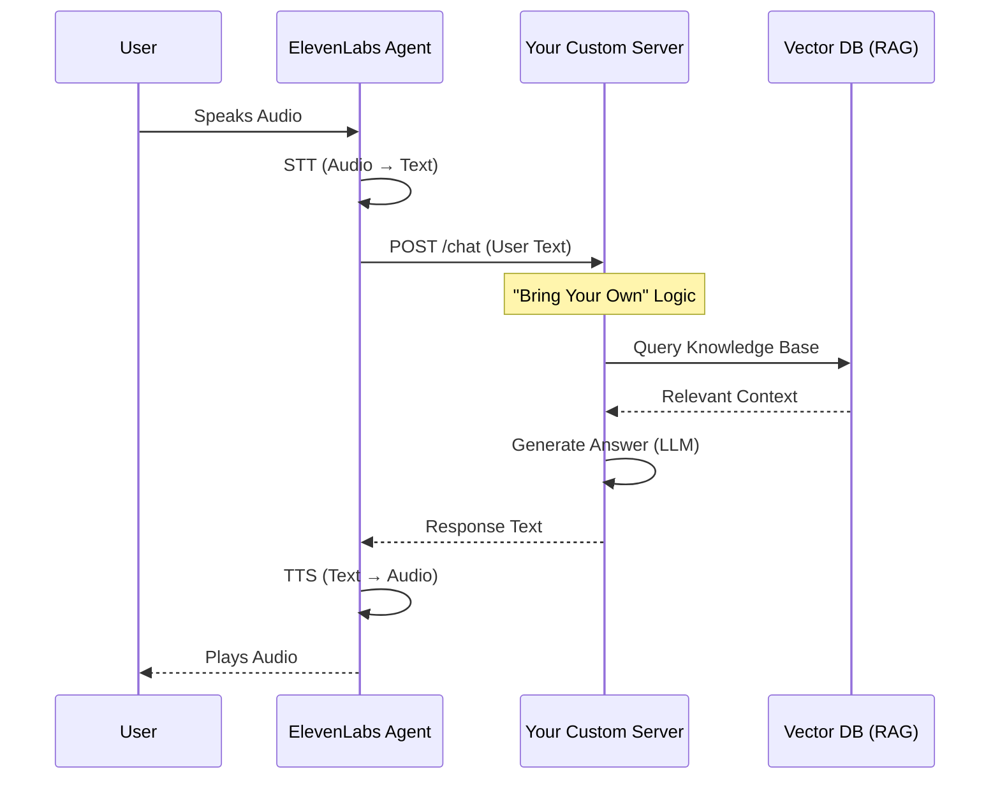

# Custom LLM and RAG Integration

This guide explains how to extend ElevenLabs Conversational AI Agents by bringing your own Large Language Model (LLM) and Retrieval-Augmented Generation (RAG) knowledge base.

## Overview

By default, an ElevenLabs Agent handles:

1.  **Speech-to-Text (STT)**: Converting user speech to text.
2.  **Intelligence (LLM)**: Generating a text response (using their built-in models).
3.  **Text-to-Speech (TTS)**: Converting the response back to audio.

However, for advanced use cases—such as needing detailed control over the RAG process, using a specialized model (like a fine-tuned medical LLaMA), or enforcing strict data privacy—you can replace the "Intelligence" layer with your own **Custom LLM Server**.

## 1. Bring Your Own LLM

ElevenLabs allows you to point an agent to a **WebSocket** or **HTTP** endpoint on your server. This endpoint acts as the "brain."

### When to use this?

- You need to use a model not supported natively (e.g., a local open-source model).
- You need complex "tool calling" or function execution that happens _during_ the conversation generation.
- You want strict control over the system prompt and context window management.

### Configuration

In the ElevenLabs Agent settings:

1.  Go to **Agent** > **LLM**.
2.  Select **Custom LLM Server**.
3.  Provide your **Server URL** (e.g., `https://api.your-app.com/v1/elevenlabs/chat`).
4.  Your server must accept the ElevenLabs request format and return a text stream or specific JSON format.

## 2. Bring Your Own RAG

While ElevenLabs has an excellent built-in RAG system (where you upload files to them), you might already have a mature RAG pipeline (e.g., in Pinecone, Weaviate, or Firestore).

### The Architecture

There is no "plug-and-play" button to connect an external Vector DB directly to ElevenLabs. Instead, you achieve "Bring Your Own RAG" by implementing the **Custom LLM Server** pattern described above.

### Workflow

1.  **Receive Text**: Your server receives the transcribed text from ElevenLabs.
2.  **Retrieve**: Your server queries your existing Vector Database (e.g., Firestore with Vector Search) using the user's text.
3.  **Augment**: You construction a prompt that includes:
    - System instructions.
    - Retrieved knowledge snippets.
    - Conversation history (passed by ElevenLabs or managed by you).
    - The user's latest query.
4.  **Generate**: You send this enriched prompt to your LLM (OpenAI, Gemini, etc.).
5.  **Respond**: You stream the generated text back to ElevenLabs for immediate Text-to-Speech.

### Pros & Cons

| Feature          | Built-in ElevenLabs RAG    | Bring Your Own RAG (Custom Server)  |
| :--------------- | :------------------------- | :---------------------------------- |
| **Setup Effort** | Low (Upload files)         | High (Build server, manage DB)      |
| **Control**      | Standard                   | Full (Ranking, chunks, sources)     |
| **Data Privacy** | Docs stored on ElevenLabs  | Docs stay in your secure infra      |
| **Cost**         | ElevenLabs pricing         | Your infra interactions + LLM costs |
| **Latency**      | Extremely low (Integrated) | Depends on your server speed        |

## Conclusion

For `ElevenDops`, utilizing **Bring Your Own RAG** would allow us to leverage our existing Firestore Knowledge Base directly without syncing documents to ElevenLabs. Typically, we recommend starting with the Built-in RAG for speed of development, and migrating to Custom Server RAG only if specific limitations are encountered.
