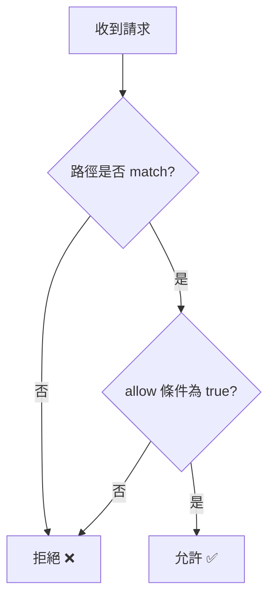

# Security Rules 基礎

## 關鍵字

- **Security Rules**：定義誰可以讀寫 Firestore/Storage 資料的規則。
- **match**：指定規則套用的路徑。
- **allow**：定義允許的操作類型（read, write, create, update, delete）。
- **request**：包含發起請求者的資訊（如 auth 狀態）。
- **resource**：包含目標資料的資訊。

## 學習目標

完成本章節後，您將能夠：

1. 理解 Security Rules 的基本語法
2. 撰寫簡單的讀寫權限規則
3. 區分 read/write 與細粒度操作

## 步驟說明

### 步驟 1：理解 Rules 的結構

#### 我們在做什麼？

Security Rules 使用宣告式語法，定義哪些路徑允許哪些操作。

#### 為什麼需要這樣做？

預設情況下，Firestore 會拒絕所有請求。你必須明確寫出允許規則。

#### 基本結構

```javascript
rules_version = '2';
service cloud.firestore {
  match /databases/{database}/documents {
    // 所有規則都在這裡
    match /users/{userId} {
      allow read, write: if request.auth != null;
    }
  }
}
```

### 步驟 2：理解 match 路徑

#### 我們在做什麼？

`match` 語句定義規則套用的路徑範圍。

#### 路徑語法

```javascript
// 精確匹配單一文件
match /users/specific_user_id {
  // 只套用到這個特定文件
}

// 萬用字元匹配
match /users/{userId} {
  // 套用到 users 下的所有文件
  // userId 變數可在規則中使用
}

// 遞迴萬用字元 (匹配子集合)
match /users/{userId}/{document=**} {
  // 套用到 users 下的所有文件和子集合
}
```

### 步驟 3：理解 allow 條件

#### 我們在做什麼？

`allow` 語句定義在什麼條件下允許操作。

#### 操作類型

```javascript
match /posts/{postId} {
  // 粗粒度操作
  allow read;    // 允許 get 和 list
  allow write;   // 允許 create, update, delete

  // 細粒度操作
  allow get;     // 讀取單一文件
  allow list;    // 查詢多個文件
  allow create;  // 建立新文件
  allow update;  // 更新現有文件
  allow delete;  // 刪除文件
}
```

#### 條件表達式

```javascript
match /users/{userId} {
  // 只有登入者可讀取
  allow read: if request.auth != null;

  // 只有本人可寫入
  allow write: if request.auth.uid == userId;

  // 多重條件
  allow update: if request.auth != null
                && request.auth.uid == userId
                && request.resource.data.email == resource.data.email;
                // 不允許修改 email 欄位
}
```

#### 流程圖



## 常見問題 Q&A

### Q1：規則是 OR 還是 AND 關係？

**答：** 同一個 `allow` 內的條件是 AND。多個 `allow` 語句是 OR（任一通過即可）。

### Q2：我設定了 `allow read` 但查詢還是失敗？

**答：** 檢查是否有索引問題。Security Rules 只控制權限，查詢本身可能因為缺少索引而失敗。

## 重點整理

| 概念              | 說明       | 範例                |
| ----------------- | ---------- | ------------------- |
| **match**         | 路徑匹配   | `/users/{userId}`   |
| **allow**         | 操作許可   | `allow read, write` |
| **request.auth**  | 請求者身分 | 檢查登入狀態        |
| **resource.data** | 目標資料   | 驗證欄位值          |

## 延伸閱讀

- [Security Rules 語法參考](https://firebase.google.com/docs/rules/rules-language)

---

## 參考程式碼來源

| 檔案路徑          | 說明                                         |
| ----------------- | -------------------------------------------- |
| `firestore.rules` | 專案的 Firestore Security Rules 檔案（如有） |
