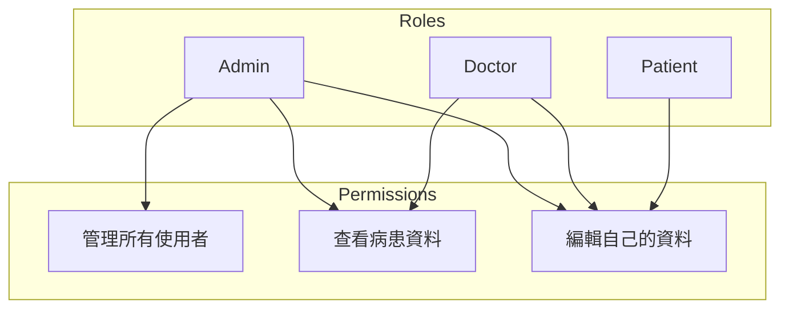

# 角色型存取控制 (RBAC)

## 關鍵字

- **RBAC**：Role-Based Access Control，根據使用者角色決定權限。
- **Custom Claims**：Firebase Auth 中附加於 JWT Token 的自訂資料。
- **Firestore Role Field**：將角色資訊儲存在 Firestore User Document 中。

## 學習目標

完成本章節後，您將能夠：

1. 實作基於角色的存取控制
2. 使用 Custom Claims 儲存角色資訊
3. 在 Security Rules 中驗證角色

## 步驟說明

### 步驟 1：理解 RBAC 模式

#### 我們在做什麼？

定義不同角色（如 admin, doctor, patient）並根據角色授予不同權限。

#### 為什麼需要這樣做？

比起為每個使用者單獨設定權限，角色模式更易於管理與擴展。

#### 角色範例



### 步驟 2：使用 Custom Claims

#### 我們在做什麼？

在 Firebase Auth 的 Token 中加入角色資訊，讓 Security Rules 可以直接讀取。

#### 後端設定 Custom Claims

```python
# 使用 Firebase Admin SDK 設定 Custom Claims
import firebase_admin
from firebase_admin import auth

# 設定使用者角色
auth.set_custom_user_claims(uid, {"role": "doctor"})

# 設定多個角色
auth.set_custom_user_claims(uid, {
    "role": "doctor",
    "department": "cardiology",
    "can_approve": True
})
```

#### 在 Security Rules 中讀取

```javascript
match /patients/{patientId} {
  // 只有醫生和管理員可讀取
  allow read: if request.auth.token.role == "doctor"
              || request.auth.token.role == "admin";

  // 只有管理員可寫入
  allow write: if request.auth.token.role == "admin";
}
```

### 步驟 3：使用 Firestore 儲存角色

#### 我們在做什麼？

另一種方式是將角色資訊儲存在 Firestore 的 User Document 中。

#### 為什麼需要這樣做？

- Custom Claims 更新後需要使用者重新登入才會生效
- 若角色需要頻繁變更，儲存在 Firestore 更方便

#### Security Rules 範例

```javascript
match /patients/{patientId} {
  allow read: if isDoctor() || isAdmin();
}

// Helper Function
function isDoctor() {
  return get(/databases/$(database)/documents/users/$(request.auth.uid)).data.role == "doctor";
}

function isAdmin() {
  return get(/databases/$(database)/documents/users/$(request.auth.uid)).data.role == "admin";
}
```

> [!WARNING]
> 使用 `get()` 會計算一次讀取操作費用，且可能影響效能。適合角色變更頻繁的情境。

### 步驟 4：複合條件

#### 程式碼範例

```javascript
match /medical_records/{recordId} {
  // 只有管理員或該記錄的負責醫生可讀取
  allow read: if request.auth.token.role == "admin"
              || (request.auth.token.role == "doctor"
                  && resource.data.doctor_id == request.auth.uid);

  // 只有負責醫生可更新，且不能修改 patient_id
  allow update: if request.auth.token.role == "doctor"
                && resource.data.doctor_id == request.auth.uid
                && request.resource.data.patient_id == resource.data.patient_id;
}
```

## 常見問題 Q&A

### Q1：Custom Claims 和 Firestore Role 哪個好？

**答：**
| 方式 | 優點 | 缺點 |
|------|------|------|
| **Custom Claims** | 效能好，無額外讀取 | 更新後需重新登入 |
| **Firestore Role** | 即時生效 | 每次驗證多一次讀取 |

### Q2：如何防止使用者自己修改角色？

**答：** Custom Claims 只能由 Admin SDK 設定。若用 Firestore，需在 Rules 中禁止修改 `role` 欄位。

## 重點整理

| 概念                 | 說明                 | 使用時機           |
| -------------------- | -------------------- | ------------------ |
| **Custom Claims**    | 附加在 JWT Token     | 角色穩定、效能優先 |
| **Firestore Role**   | 儲存在 User Document | 角色需即時更新     |
| **Helper Functions** | 封裝複雜邏輯         | 提高可讀性         |

---

## 參考程式碼來源

| 檔案路徑                                     | 說明                |
| -------------------------------------------- | ------------------- |
| `backend/services/firestore_data_service.py` | User 相關操作可參考 |
