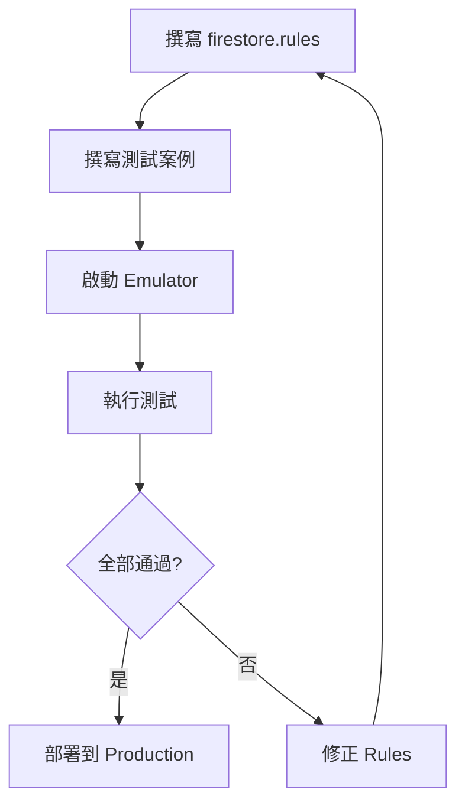

# 使用 Emulator 測試 Security Rules

## 關鍵字

- **Firebase Emulator**：本地模擬 Firebase 服務的工具。
- **Rules Unit Test**：針對 Security Rules 的單元測試。
- **@firebase/rules-unit-testing**：官方提供的測試 SDK。

## 學習目標

完成本章節後，您將能夠：

1. 設定 Firebase Emulator 進行本地測試
2. 撰寫 Security Rules 單元測試
3. 在部署前驗證規則的正確性

## 步驟說明

### 步驟 1：設定 Firebase Emulator

#### 我們在做什麼？

使用 Firebase Emulator Suite 在本地模擬 Firestore 和 Auth 服務。

#### 為什麼需要這樣做？

在本地測試規則變更，避免直接在生產環境實驗，也可以加入 CI/CD 流程。

#### 安裝與啟動

```bash
# 安裝 Firebase CLI
npm install -g firebase-tools

# 初始化 (選擇 Firestore 和 Emulators)
firebase init

# 啟動 Emulator
firebase emulators:start --only firestore
```

### 步驟 2：撰寫測試規則

#### 我們在做什麼？

使用 JavaScript/TypeScript 撰寫測試案例，驗證規則行為。

#### 測試套件設定

```typescript
// tests/firestore.rules.test.ts
import {
  initializeTestEnvironment,
  RulesTestEnvironment,
  assertSucceeds,
  assertFails,
} from "@firebase/rules-unit-testing";
import { readFileSync } from "fs";

let testEnv: RulesTestEnvironment;

beforeAll(async () => {
  testEnv = await initializeTestEnvironment({
    projectId: "demo-test-project",
    firestore: {
      rules: readFileSync("firestore.rules", "utf8"),
      host: "localhost",
      port: 8080,
    },
  });
});

afterAll(async () => {
  await testEnv.cleanup();
});
```

### 步驟 3：測試讀取權限

#### 程式碼範例

```typescript
describe("Users collection", () => {
  it("未登入使用者無法讀取", async () => {
    // 建立未認證的 context
    const unauthedDb = testEnv.unauthenticatedContext().firestore();

    // 預期失敗
    await assertFails(unauthedDb.collection("users").doc("user123").get());
  });

  it("登入使用者可讀取自己的資料", async () => {
    // 建立認證的 context
    const authedDb = testEnv.authenticatedContext("user123").firestore();

    // 預期成功
    await assertSucceeds(authedDb.collection("users").doc("user123").get());
  });

  it("登入使用者無法讀取他人資料", async () => {
    const authedDb = testEnv.authenticatedContext("user123").firestore();

    // 預期失敗
    await assertFails(authedDb.collection("users").doc("user456").get());
  });
});
```

### 步驟 4：測試 Custom Claims

#### 程式碼範例

```typescript
describe("Admin operations", () => {
  it("管理員可刪除任何使用者", async () => {
    // 設定 Custom Claims
    const adminDb = testEnv
      .authenticatedContext("admin001", {
        role: "admin",
      })
      .firestore();

    await assertSucceeds(adminDb.collection("users").doc("user123").delete());
  });

  it("一般使用者無法刪除他人", async () => {
    const userDb = testEnv
      .authenticatedContext("user123", {
        role: "user",
      })
      .firestore();

    await assertFails(userDb.collection("users").doc("user456").delete());
  });
});
```

#### 測試流程圖



## 常見問題 Q&A

### Q1：測試時如何預先填入資料？

**答：** 使用 `testEnv.withSecurityRulesDisabled()` 暫時繞過規則來設定初始資料。

```typescript
await testEnv.withSecurityRulesDisabled(async (ctx) => {
  await ctx.firestore().collection("users").doc("user123").set({
    name: "Test User",
    role: "doctor",
  });
});
```

### Q2：如何在 CI/CD 中執行測試？

**答：** 在 GitHub Actions 中啟動 Emulator，然後執行測試命令。

```yaml
- name: Run Emulator Tests
  run: |
    firebase emulators:exec --only firestore "npm test"
```

## 重點整理

| 概念                          | 說明             | 用途         |
| ----------------------------- | ---------------- | ------------ |
| **assertSucceeds**            | 預期操作成功     | 正向測試     |
| **assertFails**               | 預期操作失敗     | 負向測試     |
| **authenticatedContext**      | 模擬登入使用者   | 測試權限     |
| **withSecurityRulesDisabled** | 繞過規則設定資料 | 測試前置準備 |

## 延伸閱讀

- [Firebase Rules Unit Testing](https://firebase.google.com/docs/rules/unit-tests)

---

## 參考程式碼來源

| 檔案路徑                 | 說明                       |
| ------------------------ | -------------------------- |
| `docker-compose.dev.yml` | 本專案的 Emulator 啟動配置 |
