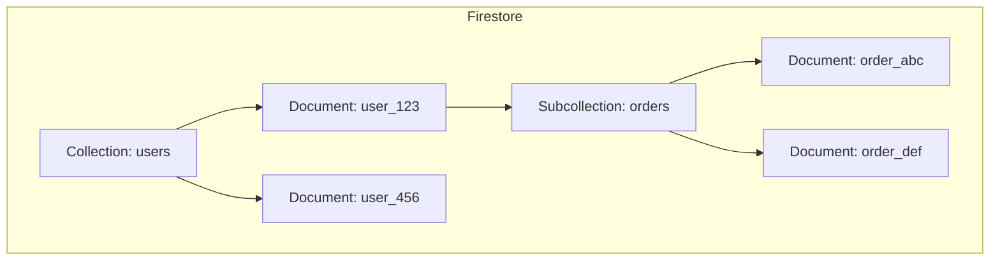
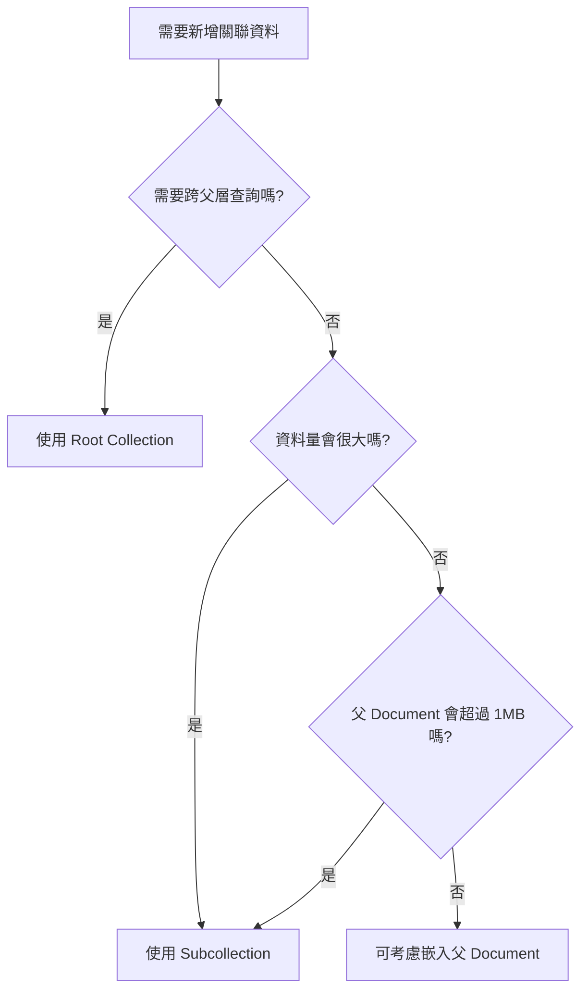

# Document 與 Collection 結構設計

## 關鍵字

- **Document**：Firestore 中儲存資料的基本單位，類似 JSON 物件。
- **Collection**：Document 的容器，類似資料夾。
- **Subcollection**：Document 內部的 Collection，形成階層結構。
- **Denormalization (反正規化)**：刻意複製資料以減少查詢次數。

## 學習目標

完成本章節後，您將能夠：

1. 設計符合 Firestore 特性的資料結構
2. 判斷何時使用 Subcollection vs Root Collection
3. 理解反正規化的利弊與適用場景

## 步驟說明

### 步驟 1：理解 Firestore 的資料模型

#### 我們在做什麼？

Firestore 是一個 NoSQL 文件資料庫。與關聯式資料庫 (SQL) 不同，它沒有「表格」和「列」，取而代之的是「Collection」和「Document」。

#### 為什麼需要這樣做？

理解這個差異是設計良好結構的基礎。SQL 的正規化思維 (避免重複資料) 在 NoSQL 中往往會導致效能問題。

#### 結構圖



### 步驟 2：設計 Document 結構

#### 我們在做什麼？

每個 Document 最大限制為 **1MB** (Standard Edition)。因此需要思考哪些欄位應該放在同一個 Document 中。

#### 程式碼範例

```python
# backend/services/firestore_data_service.py
# 範例：Agent 的 Document 結構

agent_data = {
    "agent_id": "abc-123",
    "name": "Patient Simulator",
    "language": "zh-TW",
    "voice_id": "voice_xyz",
    "system_prompt": "You are a patient...",
    "created_at": firestore.SERVER_TIMESTAMP,
    # 嵌入式資料 (Embedded Data) - 適合小型、不常變動的資料
    "first_message": "你好，我是病患...",
    "settings": {
        "temperature": 0.7,
        "max_tokens": 500
    }
}
```

### 步驟 3：選擇 Root Collection vs Subcollection

#### 我們在做什麼？

決定是否將相關資料放在 Subcollection 或獨立的 Root Collection。

#### 為什麼需要這樣做？

| 結構                | 優點                     | 缺點                 |
| ------------------- | ------------------------ | -------------------- |
| **Subcollection**   | 關聯性明確，權限繼承方便 | 無法跨 Document 查詢 |
| **Root Collection** | 可跨整個 Collection 查詢 | 需手動管理關聯       |

#### 決策流程圖



## 常見問題 Q&A

### Q1：什麼時候應該使用反正規化？

**答：** 當你發現每次讀取都需要額外查詢其他 Document 時。例如：顯示訂單時需要顯示客戶名稱，可以將客戶名稱複製到訂單 Document 中，避免每次都額外查詢 users 集合。

### Q2：反正規化後資料不一致怎麼辦？

**答：** 使用 Cloud Functions 或 Transaction 來同步更新。接受「最終一致性」的設計哲學。

## 重點整理

| 概念                | 說明                         | 使用時機                             |
| ------------------- | ---------------------------- | ------------------------------------ |
| **Embedded Data**   | 資料直接放在 Document 欄位中 | 小型、與父資料緊密關聯、不常獨立查詢 |
| **Subcollection**   | Document 下的子 Collection   | 資料量大、需要分頁、不需跨父層查詢   |
| **Root Collection** | 頂層獨立的 Collection        | 需要全域查詢、資料相對獨立           |

---

## 參考程式碼來源

| 檔案路徑                                     | 說明                             |
| -------------------------------------------- | -------------------------------- |
| `backend/services/firestore_data_service.py` | 專案中 Firestore CRUD 的核心實作 |

---

[⬅️ 返回 Firestore 資料建模索引](./index.md)
