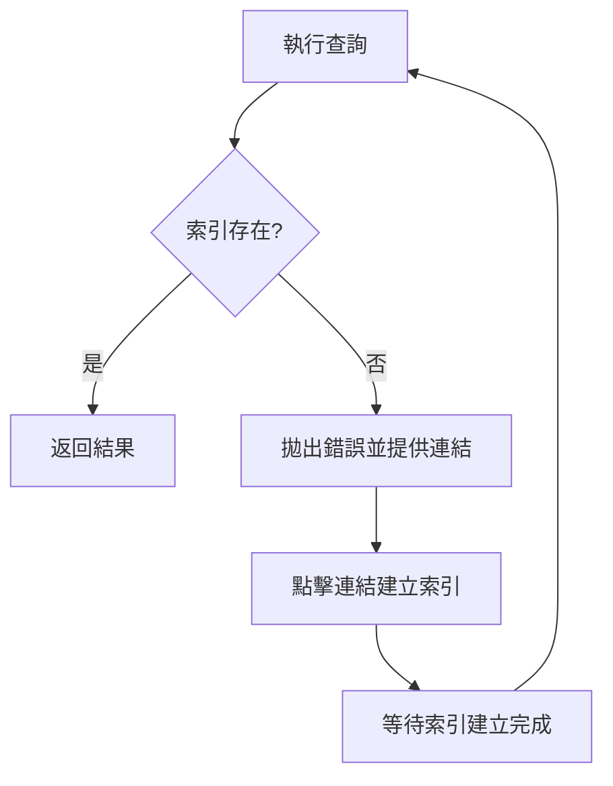

# 查詢與索引優化

## 關鍵字

- **Query (查詢)**：從 Collection 中篩選 Document 的操作。
- **Composite Index (複合索引)**：針對多欄位查詢預先建立的索引。
- **Query Limitation (查詢限制)**：Firestore 單一查詢無法同時對多個欄位使用不等式。

## 學習目標

完成本章節後，您將能夠：

1. 理解 Firestore 的查詢限制與設計原因
2. 建立與管理複合索引
3. 設計適合頻繁查詢的資料結構

## 步驟說明

### 步驟 1：理解基本查詢

#### 我們在做什麼？

Firestore 查詢使用鏈式方法 (Method Chaining) 來組合篩選條件。

#### 程式碼範例

```python
# 基本查詢範例
from google.cloud import firestore

db = firestore.Client()

# 單一條件查詢
agents_ref = db.collection("agents")
query = agents_ref.where("language", "==", "zh-TW")

# 多條件查詢 (AND)
query = agents_ref.where("language", "==", "zh-TW").where("is_active", "==", True)

# 排序與限制
query = agents_ref.order_by("created_at", direction=firestore.Query.DESCENDING).limit(10)

# 執行查詢
docs = query.stream()
for doc in docs:
    print(f"{doc.id} => {doc.to_dict()}")
```

### 步驟 2：理解查詢限制

#### 我們在做什麼？

認識 Firestore 的「單一不等式欄位」限制。

#### 為什麼需要這樣做？

這是 Firestore 保證查詢效能的設計決定。每個查詢都必須對應到一個索引，確保 O(結果數量) 的時間複雜度。

#### 限制範例

```python
# ❌ 錯誤：同時對兩個不同欄位使用不等式
query = agents_ref.where("created_at", ">", start_date).where("score", "<", 0.5)
# 這會拋出錯誤！

# ✅ 正確：只對一個欄位使用不等式，其他用等式
query = agents_ref.where("language", "==", "zh-TW").where("score", "<", 0.5)
```

### 步驟 3：建立複合索引

#### 我們在做什麼？

當查詢涉及多欄位（特別是 `where` + `order_by` 組合）時，需要建立複合索引。

#### 為什麼需要這樣做？

Firestore 會在錯誤訊息中提供建立索引的連結，點擊即可自動建立。

#### 流程圖



## 常見問題 Q&A

### Q1：索引會增加寫入成本嗎？

**答：** 是的。每個索引都會在寫入時同步更新，因此索引越多，寫入越慢且成本越高。只建立必要的索引。

### Q2：如何查看現有索引？

**答：** 在 GCP Console > Firestore > Indexes 頁面可以查看所有索引狀態。

## 重點整理

| 概念           | 說明                             | 注意事項             |
| -------------- | -------------------------------- | -------------------- |
| **單欄位索引** | 自動建立，無需手動管理           | 預設對所有欄位建立   |
| **複合索引**   | 多欄位查詢需要手動建立           | 透過錯誤連結快速建立 |
| **不等式限制** | 單一查詢只能對一個欄位使用不等式 | 設計資料結構時需考慮 |

## 延伸閱讀

- [Firestore Indexes 官方文件](https://firebase.google.com/docs/firestore/query-data/indexing)

---

## 參考程式碼來源

| 檔案路徑                                     | 說明                                       |
| -------------------------------------------- | ------------------------------------------ |
| `backend/services/firestore_data_service.py` | 查詢實作範例 (如 `get_agents_by_language`) |

---

[⬅️ 返回 Firestore 資料建模索引](./index.md)
