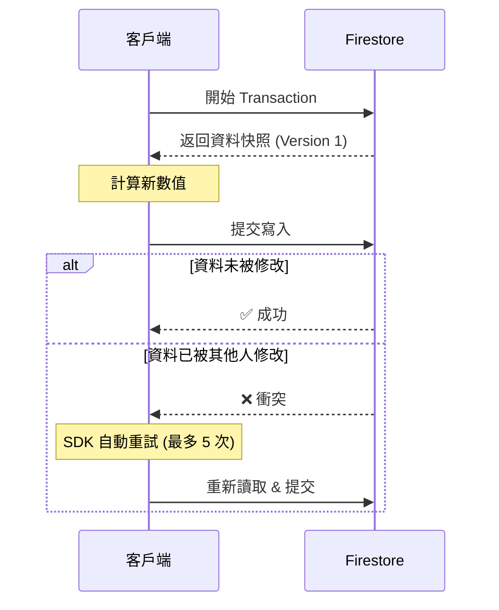

# 交易與批次寫入

## 關鍵字

- **Transaction (交易)**：一組「讀取 + 寫入」操作，保證原子性與一致性。
- **Batch Write (批次寫入)**：一組「僅寫入」操作，單次提交多個變更。
- **Atomic (原子性)**：操作要嘛全部成功，要嘛全部失敗，沒有中間狀態。

## 學習目標

完成本章節後，您將能夠：

1. 區分 Transaction 與 Batch Write 的使用場景
2. 正確實作 Firestore Transaction
3. 理解樂觀鎖 (Optimistic Locking) 的重試機制

## 步驟說明

### 步驟 1：理解 Batch Write

#### 我們在做什麼？

當需要一次性新增、更新、刪除多個 Document 時，使用 Batch Write 可以確保原子性。

#### 為什麼需要這樣做？

單獨呼叫多次 `set()` 或 `delete()` 時，若中途網路中斷，可能導致部分成功、部分失敗的不一致狀態。

#### 程式碼範例

```python
from google.cloud import firestore

db = firestore.Client()

# 建立批次
batch = db.batch()

# 新增多個 Document
for i in range(5):
    doc_ref = db.collection("logs").document()
    batch.set(doc_ref, {"index": i, "timestamp": firestore.SERVER_TIMESTAMP})

# 更新現有 Document
user_ref = db.collection("users").document("user_123")
batch.update(user_ref, {"login_count": firestore.Increment(1)})

# 刪除 Document
old_ref = db.collection("drafts").document("old_draft")
batch.delete(old_ref)

# 一次性提交 (最多 500 個操作)
batch.commit()
```

### 步驟 2：理解 Transaction

#### 我們在做什麼？

當寫入操作需要依賴當前資料的讀取結果時，使用 Transaction。

#### 為什麼需要這樣做？

例如：扣減庫存。你必須先讀取當前庫存，確認足夠，再扣減。如果兩個請求同時進行，沒有 Transaction 會導致超賣。

#### 程式碼範例

```python
from google.cloud import firestore

db = firestore.Client()

@firestore.transactional
def transfer_funds(transaction, from_ref, to_ref, amount):
    # 讀取操作 (必須在寫入之前)
    from_snapshot = from_ref.get(transaction=transaction)
    to_snapshot = to_ref.get(transaction=transaction)

    from_balance = from_snapshot.get("balance")
    to_balance = to_snapshot.get("balance")

    if from_balance < amount:
        raise ValueError("餘額不足")

    # 寫入操作
    transaction.update(from_ref, {"balance": from_balance - amount})
    transaction.update(to_ref, {"balance": to_balance + amount})

# 執行 Transaction
from_account = db.collection("accounts").document("account_A")
to_account = db.collection("accounts").document("account_B")
transaction = db.transaction()
transfer_funds(transaction, from_account, to_account, 100)
```

### 步驟 3：理解重試機制

#### 我們在做什麼？

Firestore Transaction 採用「樂觀鎖」策略。如果在 Transaction 執行期間，資料被其他操作修改，Transaction 會自動重試。

#### 流程圖



## 常見問題 Q&A

### Q1：Batch 和 Transaction 可以混用嗎？

**答：** 不行。Batch 只能包含寫入操作，Transaction 可以包含讀取和寫入。根據需求選擇其一。

### Q2：Transaction 有大小限制嗎？

**答：** 是的。單一 Transaction 最多 500 個操作，且讀取的 Document 總大小不能超過 10MB。

## 重點整理

| 概念            | 說明                     | 使用時機                          |
| --------------- | ------------------------ | --------------------------------- |
| **Batch Write** | 僅寫入，500 次操作上限   | 一次性新增/更新/刪除多個 Document |
| **Transaction** | 讀取 + 寫入，支援重試    | 寫入依賴讀取結果 (如扣減庫存)     |
| **樂觀鎖**      | 假設衝突少見，衝突時重試 | Firestore Transaction 預設策略    |

## 延伸閱讀

- [Firestore Transactions 官方文件](https://firebase.google.com/docs/firestore/manage-data/transactions)

---

## 參考程式碼來源

| 檔案路徑                                     | 說明                                     |
| -------------------------------------------- | ---------------------------------------- |
| `backend/services/firestore_data_service.py` | 可尋找 `batch` 或 `transaction` 相關實作 |

---

[⬅️ 返回 Firestore 資料建模索引](./index.md)
