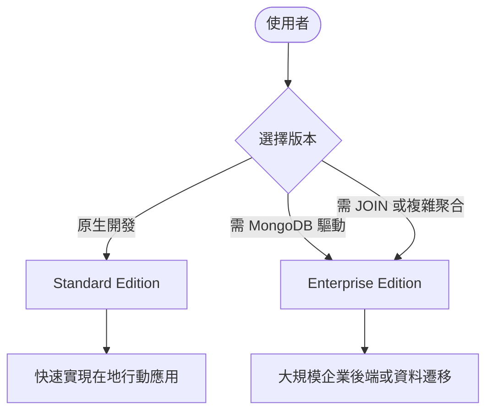

# Firestore 版本比較 (Standard vs Enterprise)

## 關鍵字

- **Standard Edition (標準版)**：原生的 Firestore 查詢引擎，適用於大多數應用程式。
- **Enterprise Edition (企業版)**：具備進階查詢功能且相容 MongoDB API 的高端版本。
- **MongoDB Compatibility**：允許直接使用 MongoDB 的驅動程式與工具操作 Firestore。
- **Auto-indexing (自動索引)**：Firestore 預設為所有欄位建立索引，簡化開發流程。

## 學習目標

完成本章節後，您將能夠：

1. 理解 Firestore 兩種版本的主要功能差異
2. 評估專案何時需要從 Standard 升級至 Enterprise
3. 明白 MongoDB 相容性對於技術棧選擇的影響

## 步驟說明

### 步驟 1：理解核心引擎差異

#### 我們在做什麼？

比較兩個版本在查詢能力與儲存技術上的不同。

#### 為什麼需要這樣做？

選擇錯誤的版本可能會導致效能限制（如查詢受限）或不必要的額外支出。

| 特性             | Standard Edition        | Enterprise Edition         |
| :--------------- | :---------------------- | :------------------------- |
| **儲存技術**     | 混合儲存 (SSD + HDD)    | 全 SSD 儲存 (效能更穩定)   |
| **文件大小上限** | 1 MiB                   | 4 MiB                      |
| **主要定位**     | 原生 Web 與行動應用開發 | 複雜後端運算、MongoDB 遷移 |

#### 流程圖

### 步驟 2：評估進階查詢需求

#### 我們在做什麼？

分析 Enterprise Edition 提供的「進階查詢」功能。

#### 為什麼需要這樣做？

Standard Edition 雖然強大，但在某些複雜查詢上有限制。Enterprise 提供：

- **$lookup (JOIN)**：能夠跨集合進行資料關聯。
- **Regex 匹配**：支援對字串進行正則表達式查詢。
- **複雜聚合**：比標準版更強大的資料加總與統計能力。

## 案例分析：筆記軟體 (Note-taking App)

如果您正在開發一個需要頻繁讀寫的筆記軟體，該如何選擇？

### 情境 A：選用 Standard Edition (推薦)

- **行為模式**：使用者頻繁自動存檔，筆記長度適中 (10 KB - 500 KB)。
- **優勢**：不管筆記多大，每次存檔只算 1 次寫入費。成本極低且容易預算。

### 情境 B：選用 Enterprise Edition

- **行為模式**：筆記包含極大量文字 (超過 1 MB) 或需要強大的全文搜尋 (Regex)。
- **優勢**：支援最高 4 MB 文件，且具備更強的資料分析與搜尋引擎能力。

---

## ElevenDops 專案建議與開發影響

### 1. 選擇哪種版本是否都可以？

**是的**。Firestore 的版本選擇是在 **GCP 雲端控制台**設定的，對於程式碼端來說，兩者都支援標準的 Firestore SDK。

### 2. 程式碼需要修改嗎？

**不需要修改。**

- ElevenDops 目前使用 `google-cloud-firestore` Python 庫。
- 這個庫與兩種版本的引擎都無縫相容。
- 除非您想特意改用 **MongoDB API** 來操作資料，才需要更換驅動程式與程式碼。

### 結論

對於 ElevenDops，即使您在雲端選擇了 Enterprise 版，現有的程式碼依然可以正常運作。但我依然建議選擇 **Standard Edition**，因為它最省錢且完全滿足目前的需求。

## 常見問題 Q&A

### Q1：ElevenDops 為什麼現在選 Standard 就好？

**答：** 因為 ElevenDops 目前的功能（管理衛教文件、紀錄對話）結構簡單，單一文件不超過 1 MiB，且我們使用的是 Python Firestore SDK 從頭開發，不需要 MongoDB 相容性。

### Q2：我之後可以切換版本嗎？

**答：** Google Cloud 目前支援將資料庫升級，但具體的切換細節與限制建議在升級前詳讀最新的 GCP 官方文件告知。

## 重點整理

| 概念            | 說明                                   |
| :-------------- | :------------------------------------- |
| **Native Mode** | Standard 的基礎，提供即時同步功能。    |
| **MongoDB API** | 僅 Enterprise 支援，方便現有專案遷移。 |
| **4 MiB Limit** | Enterprise 專有，適合大型結構化文件。  |

## 延伸閱讀

- [Firestore Editions Overview](https://cloud.google.com/firestore/docs/editions)

---

## 參考程式碼來源

| 檔案路徑                                     | 說明                                           |
| :------------------------------------------- | :--------------------------------------------- |
| `backend/services/firestore_data_service.py` | 目前實作的資料操作邏輯完全符合 Standard 版規範 |

---

[⬅️ 返回 Firestore 版本 索引](./index.md)
