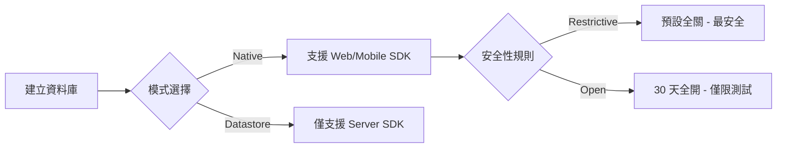

# Firestore 初始設定 (Setup Configurations)

## 關鍵字

- **Native Mode (原生模式)**：支援現代 Web/Mobile SDK 與即時同步的核心模式。
- **Datastore Mode (資料庫相容模式)**：為了相容舊版 Google Cloud Datastore 而設計的模式，僅支援伺服器端 SDK。
- **Security Rules (安全性規則)**：資料庫的內建防火牆，控制 Client 端的存取權限。
- **Restrictive (鎖定模式)**：預設讀寫全關，最安全。
- **Open (測試模式)**：30 天內全開。
- **Google-managed Key (Google 管理的金鑰)**：預設加密方式，由 Google 完全代管。
- **Cloud KMS key (客戶管理金鑰 - CMEK)**：由使用者自行控制金鑰的生命週期與權限。

## 學習目標

完成本章節後，您將能夠：

1. 識別 GCP 控制台上各項「設定選項 (Configuration options)」的具體用途。
2. 在「原生模式」與「資料庫相容模式」之間做出正確選擇。
3. 理解「Google 管理金鑰」與「客戶管理金鑰 (CMEK)」的安全級別差異。
4. 為您的專案挑選最適當的安全防護預設值。

## 步驟說明

### 步驟 1：選擇資料庫模式 (Database Mode)

在建立 Firestore 時，這些預設選項 (Presets) 決定了您組織資料以及與資料互動的方式：

##### 步驟 3：選擇加密選項 (Encryption Options)

所有 Firestore 資料預設都會進行加密，但您可以選擇金鑰的「管理權」。

#### 1. Google-managed encryption key (Google 管理金鑰) - **預設選項**

- **由誰管理**：Google 完全擁有並自動管理金鑰的建立、輪替與保存。
- **優勢**：**免費**、零管理負擔。
- **適用對象**：絕大多數應用程式（包含 ElevenDops），這已提供符合產業標準的安全保護。

#### 2. Cloud KMS key (客戶管理金鑰 - CMEK)

- **由誰管理**：客人在 GCP KMS 服務中建立金鑰，並擁有完全的控制權（可隨時停用或刪除金鑰）。
- **優勢**：符合極高規格的法規需求（如銀行、政府機關），具備更細膩的稽核日誌。
- **缺點**：**需額外付費**（KMS 金鑰與操作費用），且若誤刪金鑰，資料將永久無法救回。

---

#### 比較總結表

| 特性         | Google-managed     | Cloud KMS (CMEK)        |
| :----------- | :----------------- | :---------------------- |
| **管理難度** | 零（自動化）       | 中（需手動管理金鑰）    |
| **費用**     | 免費               | 需支付 KMS 費用         |
| **控制權**   | Google             | 客戶 (使用者)           |
| **適用場景** | 一般商用、開發測試 | 高法規遵循 (高保密行業) |

---

### 結論建議：

針對 ElevenDops 的專案規模，建議選擇 **Google-managed encryption key** 即可，既安全又不增加維運負擔。

## 案例分析：筆記軟體 (Note-taking App)

#### 1. Firestore in Native mode (原生模式)

- **功能**：啟用 Firestore 的原生伺服器端、Web 和行動 SDK。
- **優勢**：支援即時監聽、離線快取以及強大的安全性規則。
- **適用對象**：大部分現代應用程式、行動 App 以及需要即時互動的系統 (如 ElevenDops)。

#### 2. Firestore with Datastore compatibility (資料庫相容模式)

- **功能**：為伺服器端 SDK 提供 Datastore 相容性的實現。
- **優勢**：適合需要極高吞吐量的資料庫寫入，但「不支援」Web/Mobile 直連與安全性規則。
- **適用對象**：從舊版 Google Cloud Datastore 遷移的專案，或純後端的批次處理系統。

### 步驟 2：設定安全性規則 (Security Rules)

這些規則為 Web 和行動 SDK 提供**存取控制**與**資料驗證**。

#### 1. Restrictive (Locked mode，鎖定模式)

- **核心邏輯**：預設拒絕所有的讀取與寫入 (`Deny all reads and writes by default`)。
- **安全性**：最高。在您撰寫具體的安全規則前，沒有任何人能從前端存取資料。

#### 2. Open (Test mode，測試模式)

- **核心邏輯**：在接下來的 30 天內，允許任何人查看、編輯和刪除所有資料。
- **安全性**：極低。僅適用於極短期的開發原型測試，絕不可用於正式生產環境。

#### 流程圖

## 常見問題 Q&A

### Q1：如果我選了鎖定模式，我的後端 API 還能抓到資料嗎？

**答：** 絕對可以。後端使用的是「服務帳戶 (Service Account)」憑證，它具有最高管理權限，不受 Security Rules 的限制。

### Q2：我之後可以把鎖定模式改掉嗎？

**答：** 可以。您可以隨時在 Firebase/GCP 控制台的 "Rules" 分頁修改規則代碼，不需要重新建立資料庫。

## 重點整理

| 設定項         | 推薦選擇    | 優點                   |
| :------------- | :---------- | :--------------------- |
| **運作模式**   | Native mode | 支援即時同步與現代 SDK |
| **初始安全性** | Restrictive | 極致安全，防止資料外洩 |

## 延伸閱讀

- [Firestore Security Rules 指南](https://firebase.google.com/docs/firestore/security/get-started)

---

## 參考程式碼來源

| 檔案路徑                                | 說明                                                 |
| --------------------------------------- | ---------------------------------------------------- |
| `backend/services/firestore_service.py` | 使用管理權限連線的範例（不具備 Security Rules 限制） |
