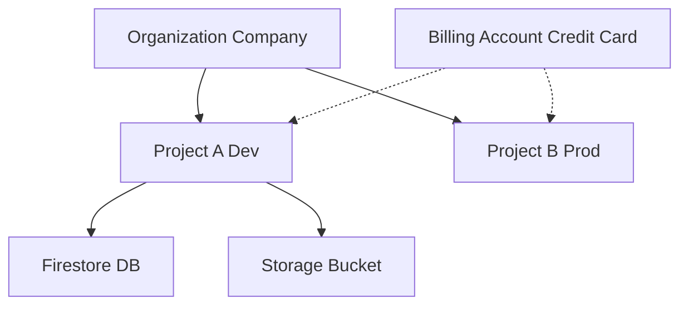

# GCP 核心基礎架構 (Core Infrastructure)

## 關鍵字

- **GCP Project (專案)**：資源的組織與計費單位
- **Billing Account (帳單帳戶)**：支付 GCP 費用的實體
- **API Enablement (啟用 API)**：開啟特定服務功能的開關
- **Region (區域)**：資源所在的實體地理位置

## 學習目標

完成本章節後，您將能夠：

1. 理解 GCP 專案與資源的階層關係
2. 明白為什麼需要啟用 API 才能使用服務
3. 選擇適合開發測試的區域 (Region)

## 步驟說明

### 步驟 1：建立與理解 GCP 專案

#### 我們在做什麼？

在遷移過程中，第一步是建立一個 **GCP Project**。

#### 為什麼需要這樣做？

在 Google Cloud 中，**Project** 是所有資源（如資料庫、儲存桶、函式）的容器。它是：

- **權限邊界**：您可以控制誰能存取這個專案內的資源。
- **計費邊界**：專案產生的費用會彙整到連結的 Billing Account。
- **命名空間**：許多資源名稱在專案內必須唯一。

#### 流程圖

### 步驟 2：啟用 API (Enable APIs)

#### 我們在做什麼？

在控制台均需手動開啟 **Cloud Firestore API** 與 **Cloud Storage API**。

#### 為什麼需要這樣做？

Google Cloud 擁有數百種服務。為了安全與管理，新專案預設**關閉**大部分 API。

- **安全性**：減少攻擊面（沒用到的服務不會被濫用）。
- **配額管理**：防止意外使用昂貴服務。

若未啟用 API 就嘗試連線，程式會收到 `403 Forbidden` 或 `Service Not Enabled` 錯誤。

### 步驟 3：選擇區域 (Region)

#### 我們在做什麼？

在建立 Firestore 或 Bucket 時，選擇如 `asia-east1` (台灣) 或 `us-central1` (愛荷華)。

#### 為什麼需要這樣做？

**Region** 決定了資料的物理儲存位置。

- **延遲 (Latency)**：選擇離使用者（或開發者您自己）最近的區域，速度最快。
- **法規**：某些資料可能依法規不能離開特定國家。
- **成本**：不同區域的流量與儲存費率略有不同。

## 常見問題 Q&A

### Q1：我可以刪除專案嗎？

**答：** 可以。刪除專案會即刻關閉所有服務連結，並在約 30 天後永久刪除所有資料。這在測試完畢想避免額外扣款時很有用。

### Q2：為什麼我啟用了 API 還是不能用？

**答：** 啟用 API 需要幾分鐘才會生效。此外，請確認您已經連結了有效的**Billing Account**，部分 API（如 TTS）即使有免費額度，也要求必須綁定信用卡以驗證身分。

## 重點整理

| 概念        | 說明         | 使用時機                           |
| ----------- | ------------ | ---------------------------------- |
| **Project** | 所有資源的家 | 開始任何 GCP 開發的第一步          |
| **API**     | 服務的開關   | 使用任何新服務（Firestore, GCS）前 |
| **Region**  | 資料物理位置 | 建立資料庫或儲存桶時決定           |

## 延伸閱讀

- [GCP Resource Hierarchy](https://cloud.google.com/resource-manager/docs/cloud-platform-resource-hierarchy)
- [GCP Locations](https://cloud.google.com/about/locations)

---

## 參考程式碼來源

| 檔案路徑       | 說明                               |
| -------------- | ---------------------------------- |
| `.env.example` | 設定 `GOOGLE_CLOUD_PROJECT` 的地方 |

---

[⬅️ 返回 GCP 遷移與基礎概念 索引](./index.md)
