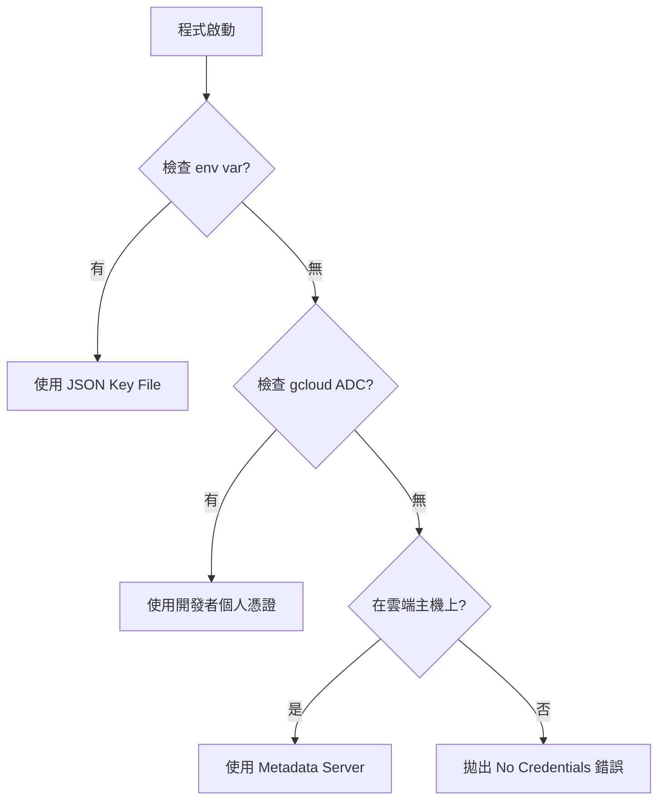

# 身分驗證機制 (Authentication & ADC)

## 關鍵字

- **ADC (Application Default Credentials)**：應用程式預設憑證，一種自動尋找憑證的機制
- **IAM (Identity and Access Management)**：身分與存取權管理
- **Service Account (服務帳戶)**：給程式（而非人類）使用的身分
- **Principal (主體)**：發起請求的實體（可能是使用者或服務帳戶）

## 學習目標

完成本章節後，您將能夠：

1. 理解本地開發如何不使用 Key File 就能通過驗證
2. 區分「使用者帳戶」與「服務帳戶」的使用場景
3. 排查常見的權限錯誤

## 步驟說明

### 步驟 1：使用 ADC 進行本地驗證

#### 我們在做什麼？

在終端機執行 `gcloud auth application-default login`。

#### 為什麼需要這樣做？

過去習慣下載一個 `.json` 金鑰檔案並設定 `GOOGLE_APPLICATION_CREDENTIALS`。但這有安全風險（金鑰容易外洩）。

**ADC** 是一個智慧機制，Google 的程式庫（如 Python Client）會依序尋找憑證：

1. **環境變數**：有無設定 `GOOGLE_APPLICATION_CREDENTIALS`？
2. **gcloud 本地憑證**：有無執行過 `gcloud auth application-default login`？
3. **雲端環境**：是否正跑在 Cloud Run/GCE 上（自動使用綁定的服務帳戶）？

在本地開發時，利用第 2 點，讓程式暫時借用您的個人權限，安全又方便。

#### 程式碼範例

```python
# backend/services/firestore_service.py
# 程式碼本身不需要知道 "我是誰"，它會自動透過 ADC 找到身分

from google.cloud import firestore

class FirestoreService:
    def __init__(self):
        # 當不傳入 credentials 參數時，Client 會自動使用 ADC
        self._db = firestore.Client(project="your-project-id")
```

#### 流程圖



### 步驟 2：設定 IAM 權限

#### 我們在做什麼？

在 GCP Console 確保您的帳號有 `Firestore Owner` 或 `Editor` 角色。

#### 為什麼需要這樣做？

**驗證 (Authentication)** 只是證明「你是誰」，**授權 (Authorization)** 才是決定「你能做什麼」。
即便您登入了，若您的帳號在該專案中沒有權限，依然無法讀寫資料庫。
ADC 登入的帳號，必須在 IAM 中被賦予適當的角色（如 `Storage Admin`, `Datastore User`）。

## 常見問題 Q&A

### Q1：我在 Docker 裡為什麼抓不到 credentials？

**答：** `gcloud auth application-default login` 的憑證存在您的**主機 (Host)** 檔案系統中（如 `~/.config/gcloud/...`）。Docker 容器是隔離的，看不到外面。
**解法**：將憑證檔案 Mount 進容器，並設定環境變數指向它（詳見遷移指南的 Troubleshooting）。

### Q2：上線到 Cloud Run 時需要做什麼設定嗎？

**答：** 不需要！這就是 ADC 的美妙之處。Cloud Run 會自動賦予容器一個「預設服務帳戶」，程式碼完全不用改，只要確保該服務帳戶有權限即可。

## 重點整理

| 概念                | 說明                  | 使用時機                      |
| ------------------- | --------------------- | ----------------------------- |
| **ADC**             | Google 建議的驗證標準 | 所有 GCP 程式開發             |
| **User Creds**      | 開發者個人憑證        | 本地開發、測試                |
| **Service Account** | 機器人專用帳號        | 正式環境部署 (Cloud Run, GCE) |

## 延伸閱讀

- [Application Default Credentials 說明](https://cloud.google.com/docs/authentication/application-default-credentials)

---

## 參考程式碼來源

| 檔案路徑                              | 說明                                     |
| ------------------------------------- | ---------------------------------------- |
| `backend/services/storage_service.py` | 其中的 `storage.Client()` 初始化依賴 ADC |
