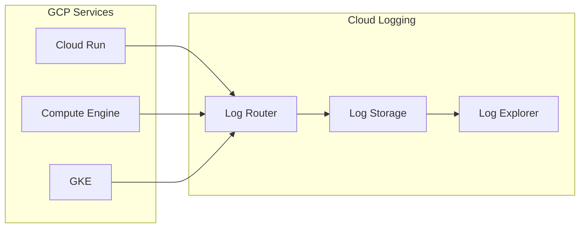

# Cloud Logging 基礎

## 關鍵字

- **Log Entry**：單一日誌紀錄，包含時間戳記、嚴重程度、訊息等。
- **Log Severity**：日誌等級（DEBUG, INFO, WARNING, ERROR, CRITICAL）。
- **Log Router**：決定日誌要送往哪裡（儲存、匯出、丟棄）。

## 學習目標

完成本章節後，您將能夠：

1. 在 GCP Console 中查看與搜尋日誌
2. 理解日誌的儲存與保留機制
3. 使用基本的日誌查詢語法

## 步驟說明

### 步驟 1：理解 Cloud Logging 架構

#### 我們在做什麼？

Cloud Logging 是 GCP 的集中式日誌服務，自動收集來自 Cloud Run、GCE、GKE 等服務的日誌。

#### 架構圖



### 步驟 2：使用 Log Explorer

#### 我們在做什麼？

在 GCP Console 的 Log Explorer 中搜尋與過濾日誌。

#### 為什麼需要這樣做？

快速定位錯誤、追蹤請求流程、分析效能問題。

#### 基本查詢範例

```text
# 查看特定 Cloud Run 服務的日誌
resource.type="cloud_run_revision"
resource.labels.service_name="my-backend"

# 只看錯誤等級以上
severity>=ERROR

# 搜尋特定文字
textPayload:"Failed to connect"

# 時間範圍 (最近 1 小時)
timestamp>="2024-01-01T00:00:00Z"

# 組合查詢
resource.type="cloud_run_revision"
resource.labels.service_name="my-backend"
severity>=WARNING
timestamp>="2024-01-01T12:00:00Z"
```

### 步驟 3：理解日誌保留期

#### 我們在做什麼？

了解日誌的儲存成本與保留政策。

#### 保留期與費用

| Log Type           | 預設保留期 | 費用     |
| ------------------ | ---------- | -------- |
| **Admin Activity** | 400 天     | 免費     |
| **Data Access**    | 30 天      | 免費     |
| **User Logs**      | 30 天      | $0.50/GB |

#### 延長保留期

```bash
# 建立 Log Bucket 並設定保留期
gcloud logging buckets create my-logs \
    --location=global \
    --retention-days=90
```

### 步驟 4：設定 Log Sink（匯出）

#### 我們在做什麼？

將日誌匯出到 BigQuery、Cloud Storage 或 Pub/Sub。

#### 為什麼需要這樣做？

- 長期保存合規日誌
- 使用 BigQuery 進行分析
- 觸發自動化流程

#### 命令列範例

```bash
# 匯出到 BigQuery
gcloud logging sinks create my-sink \
    bigquery.googleapis.com/projects/my-project/datasets/my_logs \
    --log-filter='resource.type="cloud_run_revision"'

# 匯出到 Cloud Storage
gcloud logging sinks create archive-sink \
    storage.googleapis.com/my-logs-bucket \
    --log-filter='severity>=ERROR'
```

## 常見問題 Q&A

### Q1：Cloud Run 的 print() 會出現在日誌嗎？

**答：** 會的。`print()` 輸出和 `logging` 模組的輸出都會被 Cloud Run 自動收集到 Cloud Logging。

### Q2：如何查看請求的追蹤 ID？

**答：** 每個 HTTP 請求都有 `trace` 標籤，可用於追蹤同一請求的所有日誌。

## 重點整理

| 概念             | 說明           | 用途           |
| ---------------- | -------------- | -------------- |
| **Log Explorer** | 控制台日誌介面 | 搜尋與過濾日誌 |
| **Log Router**   | 日誌路由規則   | 控制日誌流向   |
| **Log Sink**     | 匯出目的地     | 長期保存、分析 |

---

## 參考程式碼來源

| 檔案路徑                | 說明                       |
| ----------------------- | -------------------------- |
| `backend/main.py`       | FastAPI 的日誌設定         |
| `backend/services/*.py` | 各服務的 `logger` 使用方式 |
