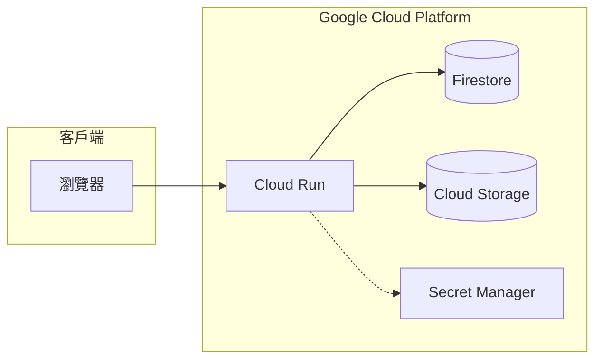

# GCP 服務概覽

## 關鍵字

- **PaaS (Platform as a Service)**：平台即服務，Google Cloud 管理基礎設施，開發者專注於程式碼。
- **Serverless**：無伺服器運算，按需自動擴展。
- **Emulator**：模擬器，用於本地開發與測試雲端服務。

## 學習目標

完成本章節後，您將能夠：

1. 說出 ElevenDops 專案使用的 GCP 核心服務及其用途。
2. 理解雲端服務在專案架構中的角色分工。
3. 分辨正式環境與本地開發環境的設定差異。

## 專案使用的 GCP 服務一覽

下表整理了本專案使用的所有 Google Cloud Platform 服務：

### 核心服務 (Core GCP Services)

| 服務                    | 用途                                                 |
| ----------------------- | ---------------------------------------------------- |
| **Cloud Run**           | 容器化部署平台，運行 FastAPI 後端與 Streamlit 前端。 |
| **Firestore**           | NoSQL 文件資料庫，儲存對話紀錄、音頻歷史等應用資料。 |
| **Cloud Storage (GCS)** | 物件儲存服務，儲存音頻檔案與上傳的文件。             |
| **Secret Manager**      | 安全密鑰管理，儲存 `ELEVENLABS_API_KEY` 等敏感資訊。 |
| **Artifact Registry**   | 容器映像檔儲存庫，用於 Cloud Run 部署。              |
| **Cloud Build**         | 自動化建置服務，編譯 Docker 映像檔。                 |

### Firebase 服務 (GCP 架構)

| 服務                        | 用途                                                                    |
| --------------------------- | ----------------------------------------------------------------------- |
| **Firebase Hosting**        | 靜態網站託管，用於 React 前端 (規劃中)。                                |
| **Firebase Emulator Suite** | 本地開發工具，模擬 **Firestore** 資料庫邏輯，支援脫機開發與自動化測試。 |

## 架構總覽圖

## 常見問題 Q&A

### Q1：為什麼選擇這些服務？

**答：** 這些服務提供了「Serverless」的開發體驗。Cloud Run 按請求計費、自動擴展；Firestore 免去資料庫維運負擔；GCS 提供高耐用性的物件儲存。這套組合非常適合中小型專案快速啟動。

### Q2：使用這些服務大約需要多少費用？

**答：** Google Cloud 提供慷慨的免費額度。對於開發階段與低流量 MVP，多數情況下可以維持在免費額度內。詳細定價請參閱 [Google Cloud 定價頁面](https://cloud.google.com/pricing)。

## 延伸閱讀

- [02--data-and-storage.md](./02--data-and-storage.md) - Firestore 與 Cloud Storage 深入介紹
- [03--deployment-and-secrets.md](./03--deployment-and-secrets.md) - Cloud Run 與 Secret Manager 實務
- [04--local-development.md](./04--local-development.md) - Firebase Emulator 本地開發指南
