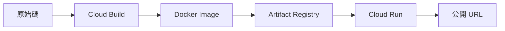

# 部署與密鑰管理

## 關鍵字

- **Cloud Run**：Google Cloud 的全託管容器運行平台。
- **Secret Manager**：安全地儲存和存取 API 金鑰、密碼等敏感資訊。
- **Artifact Registry**：儲存、管理和保護容器映像檔。
- **Cloud Build**：自動化建置 Docker 映像檔的 CI/CD 服務。

## 學習目標

完成本章節後，您將能夠：

1. 理解 Cloud Run 部署流程的各個環節。
2. 了解如何使用 Secret Manager 管理 API 金鑰。
3. 認識建置與部署的自動化流程。

## 步驟說明

### 步驟 1：Cloud Run 部署架構

#### 我們在做什麼？

理解從程式碼到雲端服務的完整流程。

#### 為什麼需要這樣做？

Cloud Run 是本專案的核心部署平台。理解其運作方式有助於問題排除與效能調優。

#### 部署流程圖



#### 重點說明

| 步驟 | 服務              | 說明                             |
| ---- | ----------------- | -------------------------------- |
| 1    | Cloud Build       | 根據 `Dockerfile` 建置映像檔     |
| 2    | Artifact Registry | 儲存建置完成的映像檔             |
| 3    | Cloud Run         | 從 Registry 拉取映像檔並啟動容器 |

---

### 步驟 2：Secret Manager 密鑰管理

#### 我們在做什麼？

了解如何安全地管理 `ELEVENLABS_API_KEY` 等敏感資訊。

#### 為什麼需要這樣做？

將 API 金鑰硬編碼在程式碼或環境變數中是危險的。Secret Manager 提供加密儲存與版本控制。

#### 使用方式 (gcloud CLI)

```bash
# 建立 Secret
gcloud secrets create ELEVENLABS_API_KEY --replication-policy="automatic"

# 新增版本 (實際的密鑰值)
echo -n "your-api-key" | gcloud secrets versions add ELEVENLABS_API_KEY --data-file=-

# 在 Cloud Run 中使用
gcloud run deploy elevendops \
  --set-secrets=ELEVENLABS_API_KEY=ELEVENLABS_API_KEY:latest
```

#### 重點說明

| 概念            | 說明                                                      |
| --------------- | --------------------------------------------------------- |
| **Secret 版本** | 每次更新密鑰會建立新版本，可指定 `:latest` 或特定版本號。 |
| **IAM 權限**    | Cloud Run 服務帳戶需要 `Secret Accessor` 角色。           |

---

### 步驟 3：認識 Cloud Build

#### 我們在做什麼？

了解自動化建置流程的設定方式。

#### 為什麼需要這樣做？

手動建置容易出錯且耗時。Cloud Build 可整合 CI/CD 流程，確保每次部署的一致性。

#### 範例 `cloudbuild.yaml`

```yaml
steps:
  # 建置 Docker 映像檔
  - name: "gcr.io/cloud-builders/docker"
    args: ["build", "-t", "gcr.io/$PROJECT_ID/elevendops:$COMMIT_SHA", "."]

  # 推送至 Artifact Registry
  - name: "gcr.io/cloud-builders/docker"
    args: ["push", "gcr.io/$PROJECT_ID/elevendops:$COMMIT_SHA"]

  # 部署至 Cloud Run
  - name: "gcr.io/google.com/cloudsdktool/cloud-sdk"
    entrypoint: "gcloud"
    args:
      - "run"
      - "deploy"
      - "elevendops"
      - "--image=gcr.io/$PROJECT_ID/elevendops:$COMMIT_SHA"
      - "--region=us-central1"
```

## 常見問題 Q&A

### Q1：部署後為什麼服務無法存取 Secret？

**答：** 請確認 Cloud Run 服務帳戶具有 `roles/secretmanager.secretAccessor` 權限。可使用以下指令授權：

```bash
gcloud secrets add-iam-policy-binding ELEVENLABS_API_KEY \
  --member="serviceAccount:YOUR_SERVICE_ACCOUNT" \
  --role="roles/secretmanager.secretAccessor"
```

### Q2：如何查看部署失敗的原因？

**答：** 可透過 Cloud Build 日誌或 Cloud Run 日誌檢視詳細錯誤訊息。

## 重點整理

| 服務                  | 用途           | 計費方式                    |
| --------------------- | -------------- | --------------------------- |
| **Cloud Run**         | 運行容器化應用 | 按請求數與 CPU/記憶體使用量 |
| **Secret Manager**    | 管理敏感憑證   | 按存取次數與版本數          |
| **Artifact Registry** | 儲存容器映像   | 按儲存空間用量              |
| **Cloud Build**       | 自動化建置     | 按建置時間                  |

## 延伸閱讀

- [Cloud Run 部署指南](../../cloud-run-deployment/guide--upload-to-cloud-run.md)
- [Secret Manager 密鑰管理](../../cloud-run-deployment/guide--secret-management.md)
