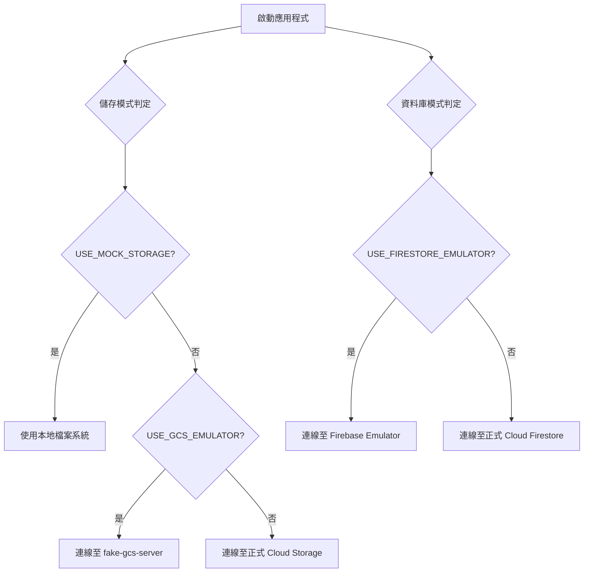

# 本地開發環境

## 關鍵字

- **Firebase Emulator Suite**：Google 提供的本地測試工具，模擬 Firestore、Storage 等服務。
- **fake-gcs-server**：開源的 Cloud Storage 模擬器。
- **Docker Compose**：多容器應用的編排工具。

## 學習目標

完成本章節後，您將能夠：

1. 理解本地開發為何需要模擬器。
2. 啟動 Firebase Emulator 與 fake-gcs-server。
3. 設定應用程式連線至模擬器。

## 步驟說明

### 步驟 1：為什麼需要模擬器？

#### 核心概念：模擬器 (Emulator) 的角色

在 ElevenDops 系統中，模擬器扮演著「替代品」的角色。它們在你的開發主機上執行，並對外提供與真實雲端服務幾乎相同的 API 介面。

- **Firebase Emulator (針對 Firestore)**：這是一個模擬 Google Cloud NoSQL 資料庫的服務。它模擬了文件格式、索引與查詢邏輯，讓你在開發後端 API 時能即時存取資料，而無需擔心資料庫讀寫頻次（Quotas）或網路延遲。
- **GCP Emulator (fake-gcs-server)**：除了基本的物件儲存，它在專案中還有以下關鍵應用：
  - **API 相容性測試**：讓後端 `StorageService` 能使用正式的 `google-cloud-storage` 函式庫，確保上傳與刪除邏輯在測試環境與正式環境完全一致。
  - **媒體存取模擬**：它提供相容於 GCS 的實體 URL（例如 `?alt=media`），讓前端開發者可以直接在本地端測試音訊播放功能，而不需要真的將檔案傳到雲端。
  - **自動化 Bucket 管理**：由於模擬器啟動時是空的，我們利用它來測試「自動建立儲存桶 (Bucket)」的初始化腳本。
  - **簽署網址 (Signed URLs) 測試**：雖然本專案目前以直接存取為主，但 `fake-gcs-server` 支援模擬具有時效性的安全存取網址，這對未來擴充安全性測試至關重要。

#### 為什麼需要這樣做？

| 情境         | 使用正式環境     | 使用模擬器      |
| ------------ | ---------------- | --------------- |
| **開發速度** | 較慢 (網路延遲)  | 快速 (本地執行) |
| **費用**     | 產生費用         | 免費            |
| **資料隔離** | 可能影響正式資料 | 完全隔離        |
| **離線開發** | 不可行           | 可行            |

---

### 步驟 2：啟動模擬器 (Docker Compose)

#### 我們在做什麼？

使用 Docker Compose 一鍵啟動所有需要的模擬器。

#### 為什麼需要這樣做？

透過容器化可確保開發環境的一致性，避免「在我電腦上可以跑」的問題。

#### Docker Compose 設定範例

```yaml
# docker-compose.dev.yml
services:
  firestore:
    image: google/cloud-sdk:latest
    command: gcloud emulators firestore start --host-port=0.0.0.0:8080
    ports:
      - "8080:8080"

  gcs:
    image: fsouza/fake-gcs-server
    ports:
      - "4443:4443"
    command: -scheme http
```

#### 啟動指令

```bash
# 啟動所有模擬器
docker-compose -f docker-compose.dev.yml up -d

# 確認服務狀態
docker-compose -f docker-compose.dev.yml ps
```

---

### 步驟 3：設定應用程式連線

#### 我們在做什麼？

設定環境變數，讓應用程式連線至本地模擬器。

#### 為什麼需要這樣做？

應用程式需要知道要連線至模擬器還是正式環境。透過環境變數可靈活切換。

#### 環境變數設定 (.env)

```bash
# 啟用模擬器
USE_FIRESTORE_EMULATOR=true
FIRESTORE_EMULATOR_HOST=localhost:8080

USE_GCS_EMULATOR=true
GCS_EMULATOR_HOST=http://localhost:4443

# 或使用簡易的 Mock Storage (不需啟動容器)
USE_MOCK_STORAGE=true
```

#### 模式選擇流程圖 (完整版)



## 常見問題 Q&A

### Q1：模擬器的資料會持久化嗎？設定路徑後就「自動」儲存了嗎？

**答：** 只是設定路徑（Volume Mapping）是不夠的，系統必須被告知要將資料「寫入」該路徑。本專案已完成以下配置：

1.  **GCS (fake-gcs-server)**：透過指令參數 `-backend filesystem -filesystem-root /data` 強制將檔案寫入對應目錄。設定 `EMULATOR_DATA_PATH` 後，上傳的檔案會直接出現在本地資料夾中。
2.  **Firestore**：由於官方模擬器預設是記憶體執行，我們在 `docker-compose.dev.yml` 加入了 `--import-data` 與 `--export-on-exit` 標籤。這意味著：
    - **啟動時**：會嘗試從該路徑載入舊資料。
    - **關閉時**（當您下達 `docker-compose down`）：會將目前的記憶體資料「匯出」到該路徑。
3.  **自動建立目錄**：Docker 會在啟動時自動為您建立 `./emulator-data` 及其子目錄。但請注意，如果您在 Windows 上遇到權限問題，可能需要手動建立該目錄一次。

**總結**：您只需在 `.env` 設定 `EMULATOR_DATA_PATH=./emulator-data` 並正常使用 `docker-compose` 啟動/關閉，資料就會如同「自動」般地被保存下來。

**設定範例 (.env)：**

```bash
# 更改模擬器資料儲存路徑（例如改到專案外部或特定磁碟區）
EMULATOR_DATA_PATH=/path/to/your/persistent/storage
```

**Docker Compose 中的實作方式：**

```yaml
volumes:
  - ${EMULATOR_DATA_PATH:-./emulator-data}/firestore:/root/.config/gcloud/emulators/firestore
```

透過 `${VAR:-DEFAULT}` 語法，系統會優先讀取環境變數，若未設定則選用預設路徑。

### Q2：如何確認模擬器是否正常運作？

**答：**

- Firestore Emulator：瀏覽 `http://localhost:8080`
- fake-gcs-server：瀏覽 `http://localhost:4443/storage/v1/b` 查看 Bucket 列表

### Q3：能否同時連線模擬器和正式環境？

**答：** 可以，但需要分別設定不同的服務實例。通常不建議這樣做，以避免混淆。

## 重點整理

| 工具                  | 模擬服務      | 預設埠號 |
| --------------------- | ------------- | -------- |
| **Firebase Emulator** | Firestore     | 8080     |
| **fake-gcs-server**   | Cloud Storage | 4443     |

## 延伸閱讀

- [Firebase 本地測試學習教材](../firebase-local-testing/index.md)
- [Emulator API 文件](../../emulator-api/)
- [遷移至真實 GCP 服務](../../development-guide/guide--migrate-to-real-gcp.md)
