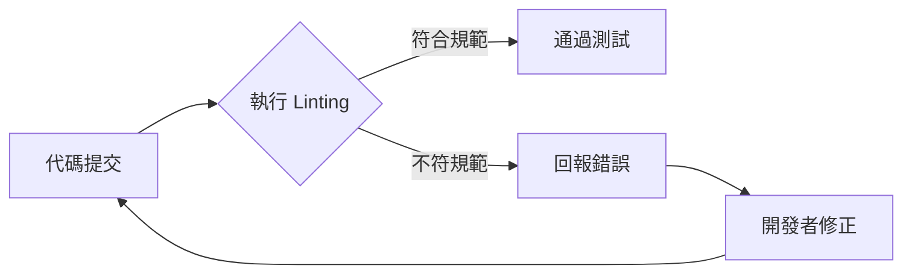

# 程式碼品質檢查 (Code Quality and Linting)

## 關鍵字

- **Linting**：靜態程式碼分析，用於檢查語法錯誤、潛在問題與格式規範。
- **oxlint**：極速的 Rust 編寫工具，用於 Python/TS 的檢查。
- **eslint**：業界標準的 JavaScript/TypeScript 檢查工具。
- **Static Analysis**：不需要執行程式碼即可進行的分析。

## 學習目標

完成本章節後，您將能夠：

1. 理解自動化 Linting 在團隊協作中的重要性。
2. 配置 GitHub Actions 以執行 oxlint 與 eslint。
3. 確保專案的程式碼風格與規範保持一致。

## 步驟說明

### 步驟 1：配置 Linting 工作流

#### 我們在做什麼？

在 `.yml` 檔案中定義執行 Linting 的作業 (Jobs)，並在 push 或 PR 時觸發。

#### 為什麼需要這樣做？

「人」會遺忘規範，但「工具」不會。自動化檢查能確保進入主分支的程式碼都符合專案定義的高品質標準（如規範中的 oxlint 首選原則）。

#### 程式碼範例

```yaml
# .github/workflows/lint.yml
name: Code Quality

on: [push, pull_request]

jobs:
  lint:
    runs-on: ubuntu-latest
    steps:
      - uses: actions/checkout@v4

      - name: 執行 oxlint (快速檢查)
        run: npx oxlint@latest .

      - name: 執行 eslint (深度檢查)
        run: |
          pnpm install --no-frozen-lockfile
          pnpm lint
```

### 步驟 2：處理檢查失敗

#### 我們在做什麼？

當 Linting 偵測到違規時，GitHub Action 會以非零退出碼結束，標記該 Job 為失敗。

#### 為什麼需要這樣做？

失敗的檢查會直接反饋在 GitHub 介面上。開發者必須修正這些警告或錯誤，才能滿足合併條件，從而維持程式碼庫的整潔。

#### 流程圖



## 常見問題 Q&A

### Q1：oxlint 與 eslint 的主要差別是什麼？

**答：** oxlint 的速度極快（通常不到一秒），適合做日常的快速預檢；而 eslint 則提供更深層的規則檢查與插件支持（如 React 相關規則）。

### Q2：如果不小心錄入了不符合規範的代碼怎麼辦？

**答：** 許多工具提供 `--fix` 參數。例如您可以執行 `npx oxlint --fix` 或 `pnpm lint --fix` 來自動修正大部分的格式問題。

## 重點整理

| 工具       | 檢查對象     | 優點                         |
| ---------- | ------------ | ---------------------------- |
| **oxlint** | Python/TS/JS | 極速、預防型檢查             |
| **eslint** | TS/JS/React  | 高度自定義、語義分析         |
| **pnpm**   | 相依性管理   | 快速、省空間（符合專案規範） |

## 延伸閱讀

- [oxlint 官方網站](https://oxc.rs/docs/guide/usage/linter.html)
- [ESLint 配置指南](https://eslint.org/docs/latest/user-guide/configuring/)

---

## 參考程式碼來源

本文件中的程式碼範例參考自以下專案規範：

| 規範項目               | 說明                          |
| ---------------------- | ----------------------------- |
| **User Global Memory** | 明確要求使用 oxlint 與 eslint |
| **Package Manager**    | 明確要求使用 pnpm             |
