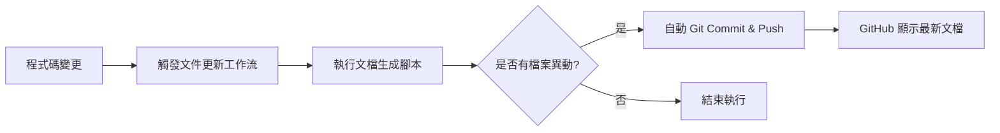

# 自動化文件更新 (Automated Documentation Updates)

## 關鍵字

- **Documentation as Code**：將文件視為程式碼，使用相同的管理工具。
- **Auto-commit**：工作流執行完畢後自動將產生的文件提交回儲存庫。
- **Workflow Permissions**：GitHub Token 的權限設定（內容寫入權限）。
- **Markdown Automation**：使用腳本自動生成 API 文件或目錄。

## 學習目標

完成本章節後，您將能夠：

1. 理解為何需要自動化更新 GitHub 文件。
2. 掌握如何在 GitHub Action 中執行 git commit 與 push。
3. 配置必要的權限以允許工作流修改儲存庫內容。

## 步驟說明

### 步驟 1：配置寫入權限 (GHR_TOKEN)

#### 我們在做什麼？

在工作流中設定 `permissions.contents: write`，允許 Action 回寫資料到儲存庫。

#### 為什麼需要這樣做？

預設情況下，工作流只有讀取權限。如果要「自動更新」文件並提交，必須明確授權，否則會遇到 `Permission denied` 錯誤。

#### 程式碼範例

```yaml
jobs:
  update-docs:
    runs-on: ubuntu-latest
    permissions:
      contents: write # 關鍵：允許寫入內容
```

### 步驟 2：執行更新腳本與自動提交

#### 我們在做什麼？

執行生成文件的腳本（如產出 API 參考），然後使用 `stefanzweifel/git-auto-commit-action` 自動處理變更。

#### 為什麼需要這樣做？

手動更新 README 或 API 文件很麻煩且容易遺漏。自動化能確保文件內容始終與程式碼邏輯保持同步。

#### 程式碼範例

```yaml
steps:
  - uses: actions/checkout@v4

  - name: 生成最新文件
    run: python scripts/generate_api_docs.py

  - name: 自動提交變更
    uses: stefanzweifel/git-auto-commit-action@v5
    with:
      commit_message: "docs: 自動更新系統文件 [skip ci]"
      file_pattern: "docs/*.md"
```

> [!NOTE]
> 使用 `[skip ci]` 可以防止自動提交再次觸發 CI 流程，避免無限迴圈。

#### 流程圖



## 常見問題 Q&A

### Q1：這會弄亂我的 Commit History 嗎？

**答：** 頻繁的自動提交確實會增加提交數。建議將此工作流設定為「定期執行（如每天一次）」或僅在合併到 `main` 時執行，以減少噪音。

### Q2：我可以用這個來更新 `task.md` 嗎？

**答：** 當然可以！如果您有腳本能根據開發狀態自動更新 `task.md`，這是一個非常棒的自動化練習。

## 重點整理

| 技術點   | 核心要素                 | 注意事項                      |
| -------- | ------------------------ | ----------------------------- |
| **權限** | `contents: write`        | 安全起見，僅在需要的 Job 開放 |
| **工具** | `git-auto-commit-action` | 最簡單的自動化提交解決方案    |
| **優化** | `[skip ci]`              | 避免觸發遞迴的建置流程        |

## 延伸閱讀

- [Git Auto Commit Action](https://github.com/stefanzweifel/git-auto-commit-action)
- [GitHub 權限管理文件](https://docs.github.com/en/actions/using-jobs/assigning-permissions-to-jobs)

---

## 參考程式碼來源

本文件中的程式碼範例參考自專案的自動化需求：

| 目標任務   | 相關路徑               |
| ---------- | ---------------------- |
| 文件自動化 | `docs/` 目錄及其子目錄 |
| 工作流定義 | `.github/workflows/`   |
