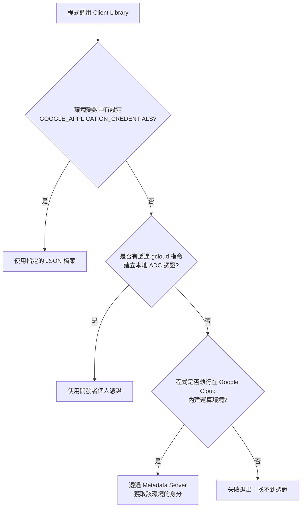

# 深入淺出 ADC (Application Default Credentials)

## 關鍵字

- **ADC**：一種自動尋找身分憑證的標準策略。
- **Library (程式庫)**：如 `google-cloud-python`, `google-cloud-storage` 等 SDK。
- **Credentials (憑證)**：用於證明身分的資訊（可能是 JSON 檔案或 Metadata）。

## 學習目標

完成本章節後，您將能夠：

1. 解釋 ADC 是什麼以及它解決了什麼問題。
2. 描述 ADC 尋找憑證的優先順序。
3. 理解「程式碼與環境解耦」的重要性。

## 步驟說明

### 步驟 1：理解 ADC 的核心邏輯

#### 我們在做什麼？

ADC 並不是一個具體的「檔案」，而是一套**邏輯法則**。它告訴 Google 的 SDK 在不同環境下應該去哪裡找「入場券」。

#### 為什麼需要這樣做？

1. **安全性**：避免將 `service-account-key.json` 下載到開發者機器，減少金鑰外洩風險。
2. **靈活性**：同一套程式碼，在本地執行時使用「開發者帳號」，在 Cloud Run 執行時使用「服務帳號」，程式碼無需修改。

#### 運作流程圖



### 步驟 2：程式碼實作範例

#### 我們在做什麼？

在撰寫後端服務時，我們儘量不要在程式碼中硬編碼 (Hard-code) 任何憑證路徑。

#### 程式碼範例

```python
# backend/services/storage_service.py
from google.cloud import storage

# 錯誤示範 (Anti-pattern)：
# storage.Client.from_service_account_json("path/to/my-key.json")
# 理由：當程式部署到雲端時，這個路徑會報錯。

# 正確做法 (Recommended)：
def get_storage_client():
    # 當不傳入參數時，SDK 會自動觸發 ADC 尋找機制
    # 它會自動看環境變數、本地登入狀態或是 Cloud Run 的身分
    return storage.Client()
```

## 常見問題 Q&A

### Q1：ADC 是不是就是 Service Account Key？

**答：** 不是。ADC 是一套**尋找順序**。在本地，它通常指向您的個人 Google 帳號；在正式環境，它通常指向該雲端資源綁定的服務帳號。

### Q2：為什麼我設定了環境變數卻沒反應？

**答：** 請確認環境變數 `GOOGLE_APPLICATION_CREDENTIALS` 指向的是檔案的**絕對路徑**，且該檔案讀取權限正確。

### Q3：ADC 是否有儲存 API Key？

**答：沒有。**
ADC 處理的是「身分驗證 (Authentication)」，它產生的是「短效期的 Access Token」。
API Key 是另一種「長效期的 Secret」，通常會放在 Secret Manager 中，透過 ADC 驗證身分後去讀取。

### Q4：ADC 是否管理權限 (Authorization)？

**答：不直接管理。**
ADC 只負責證明「你是誰 (Authentication)」。
「你能做什麼 (Authorization)」是由 **IAM (Identity and Access Management)** 系統控制的。你必須在 GCP Console 中給予該身分對應的 IAM Role (e.g. `Secret Manager Secret Accessor`)。

### Q5：登入後，我還需要去 GCP 賦予權限嗎？

**答：視情況而定。**

- **如果是你自己的專案 (你是 Owner)**：通常不需要。Owner 角色預設擁有所有權限，所以當 `gcloud` 驗證你是 Owner 後，你自動就能存取 Secret。
- **如果是團隊專案 (你是協作者)**：要。管理員需要去 IAM 頁面，把你的 Google 帳號加入，並給予 `Secret Manager Secret Accessor` 角色，你的 ADC 才會生效。

## 重點整理

| 階段         | 憑證來源                                | 安全性                 |
| ------------ | --------------------------------------- | ---------------------- |
| **本地開發** | `gcloud auth application-default login` | 高 (不產生金鑰檔)      |
| **CI/CD**    | `GOOGLE_APPLICATION_CREDENTIALS` 變數   | 中 (需由 Secrets 管理) |
| **雲端環境** | Metadata Server (自動)                  | 極高 (無檔案讀寫)      |

## 延伸閱讀

- [GCP Official Doc: How ADC works](https://cloud.google.com/docs/authentication/application-default-credentials)
- [Twelve-Factor App: Config](https://12factor.net/config)

---

## 進階實戰

關於 ADC 如何與 Secret Manager 等服務整合，以及詳細的授權流程 (Owner vs Member)，請參考下一章：

👉 **[04--ADC 授權指南與實戰整合](./04--adc-authorization-and-integration.md)**

---

## 參考程式碼來源

| 檔案路徑                              | 說明                            |
| ------------------------------------- | ------------------------------- |
| `backend/main.py`                     | 專案初始化時常用的 ADC 配置起點 |
| `backend/services/storage_service.py` | 實作 Cloud Storage 的 ADC 實例  |

---

## 參考程式碼來源

| 檔案路徑                              | 說明                            |
| ------------------------------------- | ------------------------------- |
| `backend/main.py`                     | 專案初始化時常用的 ADC 配置起點 |
| `backend/services/storage_service.py` | 實作 Cloud Storage 的 ADC 實例  |

---

[⬅️ 返回 Google Cloud 身分驗證 索引](./index.md)
