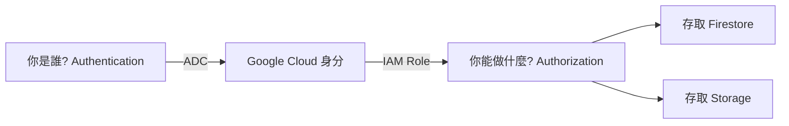

# 進階概念與錯誤排除

## 關鍵字

- **IAM Role**：定義權限的集合（如 `Firestore Admin`）。
- **Service Account**：服務專用的「虛擬身分」。
- **Metadata Server**：Google Cloud 環境中自動提供憑證的內建服務。

## 學習目標

完成本章節後，您將能夠：

1. 了解本地 ADC 與雲端 Service Account 的映射關係。
2. 解決 Docker 環境中的驗證問題。
3. 區分 Authentication (認證) 與 Authorization (授權)。

## 步驟說明

### 步驟 1：解決 Docker 隔離問題

#### 我們在做什麼？

當後端跑在 Docker 容器內時，容器就像一個獨立的箱子，看不到主機上的 ADC 檔案。

#### 為什麼需要這樣做？

為了讓開發環境與部署環境一致，我們需要讓容器也能使用主機的憑證。

#### docker-compose.yml 範例

```yaml
services:
  backend:
    build: ./backend
    environment:
      # 告訴 SDK 憑證放在容器內的什麼位置
      - GOOGLE_APPLICATION_CREDENTIALS=/root/.config/gcloud/application_default_credentials.json
    volumes:
      # 將主機的 ADC 檔案掛載進容器 (範例為 Windows 路徑)
      - ${APPDATA}/gcloud:/root/.config/gcloud
```

### 步驟 2：理解權限 (IAM)

#### 我們在做什麼？

即便你成功登入了 (Authentication)，如果沒有被分配權限 (Authorization)，程式依然會報錯 403 Forbidden。

#### 為什麼需要這樣做？

ADC 只是幫你「敲開門」，但門後的寶藏 (Firestore, Storage) 是否能拿，取決於 IAM。

#### 流程圖



### 步驟 3：生產環境的自動切換

#### 我們在做什麼？

當程式部署到 Cloud Run 時，**不需要**上傳任何 JSON 檔案，也不需要手動設定環境變數。

#### 為什麼需要這樣做？

Cloud Run 有一項內建服務叫 **Metadata Server**。當 Python SDK 發現環境變數為空、本地也沒有 `gcloud` 憑證時，最後會去問這個 Server：「我是誰？我的 Token 是什麼？」

Cloud Run 會根據您在部署時設定的 **Service Account** 給出對應的 Token。這就是 ADC 的終極形態：**零金鑰管理**。

## 常見問題 Q&A

### Q1：我明明執行了 login，但還是出現 403 Forbidden？

**答：** 請檢查 GCP Console 的 IAM 頁面。確認您登入的那個 Email 是否擁有足夠的角色（例如：`Cloud Datastore User`）。

### Q2：我可以讓 ADC 在不同專案間切換嗎？

**答：** 可以。使用 `gcloud config set project [PROJECT_ID]` 後，SDK 通常能自動識別。如果失效，請重新執行 `gcloud auth application-default login`。

## 重點整理

| 場景                         | 驗證方式                                | 建議做法              |
| ---------------------------- | --------------------------------------- | --------------------- |
| **本地開發 (直接跑 Python)** | `gcloud auth application-default login` | 最推薦，安全簡單      |
| **本地開發 (Docker)**        | Volume Mount 映射憑證                   | 需注意路徑配置        |
| **正式環境 (Cloud Run)**     | 內建 Service Account                    | 完全不需配置 (零金鑰) |

---

## 參考程式碼來源

| 檔案路徑                                               | 說明                                       |
| ------------------------------------------------------ | ------------------------------------------ |
| `docs/development-guide/guide--migrate-to-real-gcp.md` | Troubleshooting 區塊關於 Docker 的詳細說明 |
