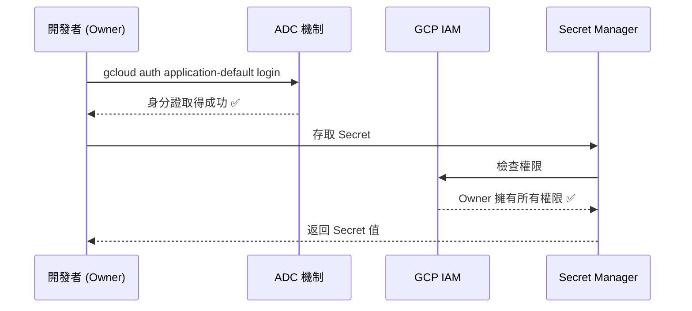
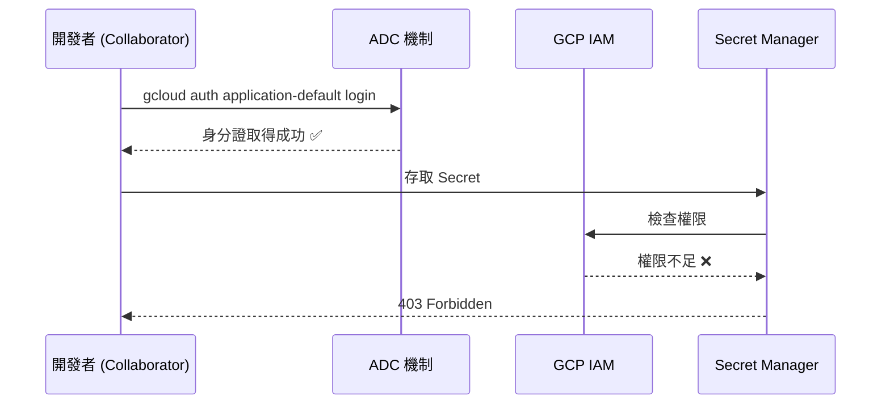
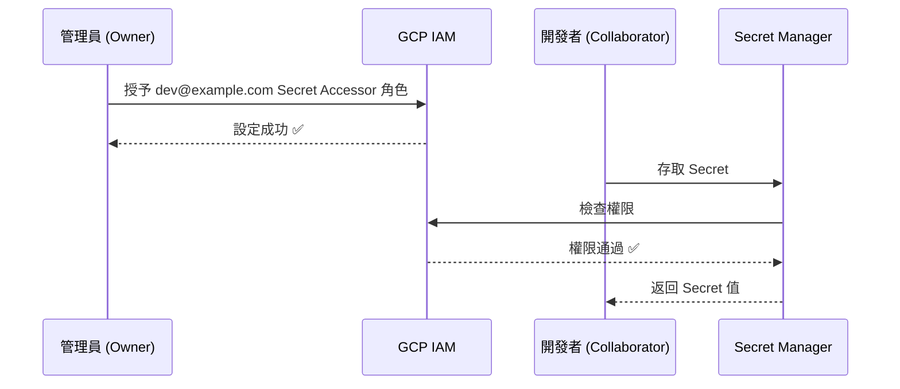

# IAM 授權指南：你需要做什麼？

## 關鍵字

- **IAM (Identity and Access Management)**：GCP 的權限管理系統。
- **Owner**：專案擁有者，擁有所有資源的完整控制權。
- **Collaborator**：協作成員，需要被授予特定權限。

## 學習目標

完成本章節後，您將能夠：

1. 判斷自己屬於「專案擁有者」還是「團隊成員」。
2. 理解兩種角色在權限設定上的差異。
3. 知道如何為團隊成員授予存取 Secret Manager、Storage、Firestore 的權限。

---

## 核心問題：取得 ADC 身分證後，還需要做什麼？

**答案是：看你是誰。**

這完全取決於你的 Google 帳號在該 GCP 專案中的「角色」。

---

## 情境一：專案擁有者 (Owner)

> **常見場景**：個人開發者、自己創建的 GCP 專案。

### 你需要做什麼？

**不需要做任何事。**

### 為什麼？

Owner 角色本身就擁有「所有權限」的 VIP 通行證。
只要 ADC 成功證明你是這個專案的 Owner，GCP 的大門就自動為你而開。

### 流程圖



### 結論

| 步驟        | 動作                                    |
| :---------- | :-------------------------------------- |
| 1. 登入 ADC | `gcloud auth application-default login` |
| 2. 設定 IAM | **不需要** (Owner 自帶權限)             |
| 3. 開始開發 | 直接執行程式碼                          |

---

## 情境二：團隊成員 (Collaborator)

> **常見場景**：公司員工、加入他人的專案、開源專案貢獻者。

### 你需要做什麼？

**需要請管理員 (Admin/Owner) 賦予權限。**

### 為什麼？

雖然你有身分證 (ADC)，但身分證只證明「你是誰」。
若專案的 IAM 系統沒有記錄「你可以做什麼」，你還是進不了門。

### 流程圖



### 解決方案：管理員需要做的事

管理員可以透過 **GCP Console (網頁)** 或 **gcloud CLI (指令)** 來授予權限。

---

#### 方法一：透過 GCP Console (網頁介面)

**步驟 1：進入 IAM 頁面**

前往 [GCP IAM 頁面](https://console.cloud.google.com/iam-admin/iam)，確認上方已選擇正確的專案。

**步驟 2：點擊「授予存取權」**

點擊頁面上方的「**+ 授予存取權**」(Grant Access) 按鈕。

**步驟 3：填寫主體與角色**

| 欄位                        | 填入內容                                              |
| :-------------------------- | :---------------------------------------------------- |
| **新主體 (New principals)** | 成員的 Google Email，例如 `developer@gmail.com`       |
| **角色 (Role)**             | 從下拉選單選擇，例如 `Secret Manager Secret Accessor` |

> 💡 **提示**：可以同時授予多個角色，點擊「+ 新增其他角色」即可。

**步驟 4：儲存**

點擊「**儲存**」(Save) 按鈕，權限即時生效。

---

#### 方法二：透過 gcloud CLI (指令)

如果管理員習慣使用指令，可以用以下命令：

```bash
# 授予 Secret Manager 存取權
gcloud projects add-iam-policy-binding [PROJECT_ID] \
    --member="user:developer@gmail.com" \
    --role="roles/secretmanager.secretAccessor"

# 授予 Cloud Storage 存取權
gcloud projects add-iam-policy-binding [PROJECT_ID] \
    --member="user:developer@gmail.com" \
    --role="roles/storage.objectAdmin"

# 授予 Firestore 存取權
gcloud projects add-iam-policy-binding [PROJECT_ID] \
    --member="user:developer@gmail.com" \
    --role="roles/datastore.user"
```

> ⚠️ **注意**：請將 `[PROJECT_ID]` 替換為實際的專案 ID，例如 `elevendops-dev`。

---

### 常見角色對照表

| 需要存取的服務     | 角色 ID                              | 顯示名稱                       | 說明                  |
| :----------------- | :----------------------------------- | :----------------------------- | :-------------------- |
| **Secret Manager** | `roles/secretmanager.secretAccessor` | Secret Manager Secret Accessor | 可讀取 Secret 值      |
| **Cloud Storage**  | `roles/storage.objectAdmin`          | Storage Object Admin           | 可上傳/下載/刪除檔案  |
| **Firestore**      | `roles/datastore.user`               | Cloud Datastore User           | 可讀寫 Firestore 資料 |

### 授權後的流程



### 結論

| 步驟        | 動作                                    | 執行者     |
| :---------- | :-------------------------------------- | :--------- |
| 1. 登入 ADC | `gcloud auth application-default login` | 開發者     |
| 2. 設定 IAM | 在 GCP Console 授予角色                 | **管理員** |
| 3. 開始開發 | 直接執行程式碼                          | 開發者     |

---

## 常見問題 Q&A

### Q1：我是獨立開發者 (Owner)，拿到身分證後還要做什麼嗎？

**答：不用。**
Owner 權限包含所有 GCP 資源的管理權，所以只要 ADC 驗證成功，程式碼就能暢行無阻。

### Q2：這個身分證 (ADC) 有時效嗎？上線後需要更新嗎？

| 環境                     | 憑證類型                           | 時效性              | 是否需要更新                     |
| :----------------------- | :--------------------------------- | :------------------ | :------------------------------- |
| **本地開發**             | User Credentials (Refresh Token)   | 長期有效            | 幾乎不用，除非更改密碼或手動撤銷 |
| **正式環境 (Cloud Run)** | Service Account (Managed Identity) | 超短效期 (自動輪替) | 完全不用，Google 每小時自動換新  |

**結論：** ADC 的設計初衷就是「**Set and Forget**」。設定一次，本地長效，雲端全自動。

---

[⬅️ 返回 Google Cloud 身分驗證 索引](./index.md)
