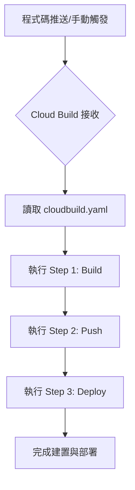

# Google Cloud Build 基礎概念

## 關鍵字

- **Build Task (建置工作)**：Cloud Build 執行的最小單元，由一系列建置步驟（Steps）組成。
- **Build Step (建置步驟)**：在容器中執行的特定指令，例如 `docker build` 或 `gcloud run deploy`。
- **Builder (建置器)**：Cloud Build 提供的主機映像檔，已預載常用工具（如 `docker`, `gcloud`, `npm`, `go`）。
- **Substituting Variables (取代變數)**：類似環境變數，可在建置時動態替換設定，以 `$_` 開頭。
- **Artifact Registry**：用來儲存及管理建置產出的容器映像檔（Container Image）的服務。

## 學習目標

完成本章節後，您將能夠：

1. 了解 Cloud Build 的核心架構與元件。
2. 理解 `cloudbuild.yaml` 檔案的基本結構。
3. 認識常見的 Cloud Builders 及其用途。

## 核心元件說明

### 1. 建置步驟 (Steps)

Cloud Build 的核心是 `steps` 陣列。每個步驟都在一個獨立的 Docker 容器中執行。您可以串聯多個步驟來完成複雜的流程。

#### 我們在做什麼？

定義建置過程中所需要執行的各種動作，如編譯、測試、打包。

#### 為什麼需要這樣做？

透過模組化的步驟，可以清晰地管理建置流程中的各個階段。

#### 範例：執行一個簡單的 echo 指令

```yaml
steps:
  - name: "ubuntu"
    args: ["echo", "Hello Cloud Build!"]
```

---

### 2. 取代變數 (Substitutions)

取代變數允許您在建置時將特定值注入到設定檔中。

#### 我們在做什麼？

在 `cloudbuild.yaml` 中使用 `${_VARIABLE_NAME}` 語法，並在 `substitutions` 區塊定義預設值。

#### 為什麼需要這樣做？

增加設定檔的靈活性，例如針對不同的環境（Staging/Production）使用不同的區域或金鑰。

#### 核心流程圖



## 常見問題 Q&A

### Q1：Cloud Build 跟 Jenkins 或 GitHub Actions 有什麼不同？

**答：** Cloud Build 是 Google Cloud 原生且完全代管的服務，不需維護伺服器。它與 Google Cloud 的其他服務（如 IAM, Artifact Registry, Cloud Run, Secret Manager）有極佳的整合，且計費方式通常以建置時數計算，非常適合雲端原生應用。

### Q2：我可以自訂建置器 (Custom Builders) 嗎？

**答：** 可以。只要您的環境可以打包成 Docker 映像檔，您就可以在 `steps` 的 `name` 欄位中使用該映像檔作為建置器。

## 重點整理

| 概念              | 說明         | 使用時機                               |
| ----------------- | ------------ | -------------------------------------- |
| Step              | 執行的動作   | 編譯、測試、部署                       |
| Builder           | 工具容器     | 需要特定工具時 (如 `docker`, `gcloud`) |
| Substitutions     | 動態變數     | 替換地區、環境名稱或標記               |
| Artifact Registry | 映像檔儲存庫 | 儲存並分發 Docker 映像檔               |

## 延伸閱讀

- [Cloud Build 組態檔結構官方文件](https://cloud.google.com/build/docs/configuring-builds/create-basic-configuration)
- [使用內建的建置器](https://cloud.google.com/build/docs/cloud-builders)
