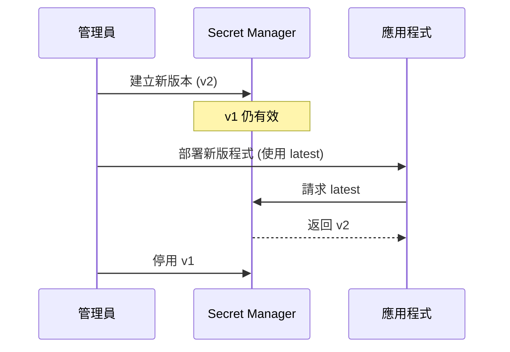

# Secret Manager 簡介

## 關鍵字

- **Secret**：儲存在 Secret Manager 中的敏感資訊。
- **Version**：每個 Secret 可以有多個版本，方便輪換。
- **Accessor**：有權限讀取 Secret 的身分（Service Account 或使用者）。
- **IAM (Identity and Access Management)**：Google Cloud 的權限管理框架，負責定義「誰」可以對「哪個資源」執行「什麼操作」。
- **Service Account**：IAM 中專門給「程式」、「虛擬機」或「服務」使用的身分帳號，與代表人類的 User Account 不同。

## 學習目標

完成本章節後，您將能夠：

1. 理解 Secret Manager 的運作方式
2. 建立與管理 Secrets
3. 理解版本控制與輪換策略

## 步驟說明

### 步驟 1：理解為何需要 Secret Manager

#### 我們在做什麼？

避免將敏感資訊 (如 API Key) 直接寫入程式碼、`.env` 檔案或 Git 倉庫。

#### 為什麼需要這樣做？

我們目前的開發演進：
**Local Emulator** (使用 .env) -> **Real GCP** (混合使用) -> **Production** (全面使用 Secret Manager)

| 方式               | 適用場景                             | 缺點 / 風險                         |
| :----------------- | :----------------------------------- | :---------------------------------- |
| **寫在程式碼**     | 絕對禁止 ❌                          | 上傳 GitHub 後永久曝光              |
| **寫在 .env**      | 本地開發、非敏感設定 (如 Project ID) | 敏感資料可能意外 commit，且難以輪換 |
| **Secret Manager** | **敏感資訊 (如 API Key)**            | 需付費、需設定 IAM (但安全性最高)   |

### 步驟 2：建立 Secret

#### 我們在做什麼？

使用 GCP Console 或 `gcloud` CLI 建立 Secret。

#### 命令列範例

```bash
# 建立一個新的 Secret
echo -n "my-api-key-value" | gcloud secrets create ELEVENLABS_API_KEY \
    --replication-policy="automatic" \
    --data-file=-

# 查看 Secret 列表
gcloud secrets list

# 查看特定 Secret 的詳細資訊
gcloud secrets describe ELEVENLABS_API_KEY
```

### 步驟 3：存取 Secret

#### 我們在做什麼？

使用 Python SDK 在程式中讀取 Secret。

#### 程式碼範例

```python
# 使用 Google Cloud Secret Manager Client
from google.cloud import secretmanager

def get_secret(project_id: str, secret_id: str, version: str = "latest") -> str:
    """
    從 Secret Manager 取得 Secret 值

    Args:
        project_id: GCP 專案 ID
        secret_id: Secret 名稱
        version: 版本號 (預設 latest)

    Returns:
        Secret 的實際值
    """
    client = secretmanager.SecretManagerServiceClient()

    # 建構 Secret 路徑
    name = f"projects/{project_id}/secrets/{secret_id}/versions/{version}"

    # 存取 Secret
    response = client.access_secret_version(request={"name": name})

    # 回傳解碼後的值
    return response.payload.data.decode("UTF-8")

# 使用範例
api_key = get_secret("elevendops-dev", "ELEVENLABS_API_KEY")
```

> **💡 重要概念：ADC 與 Secret Manager 的關係**
>
> 上述程式碼中 `SecretManagerServiceClient()` 沒有傳入任何憑證，這是因為 SDK 內部會自動透過 **ADC (Application Default Credentials)** 機制來獲取身分。
>
> - **ADC** 解決：**你是誰？**（提供身分憑證）
> - **IAM** 解決：**你能做什麼？**（`Secret Manager Secret Accessor` 角色）
> - **Secret Manager** 解決：**你要拿什麼？**（儲存的敏感資訊）
>
> 詳見：[深入淺出 ADC](../google-cloud-authentication/01--introduction-to-adc.md)

### 步驟 4：版本管理

#### 我們在做什麼？

透過版本控制實現 API Key 輪換。

#### 流程圖



#### 命令列範例

```bash
# 新增新版本
echo -n "new-api-key-value" | gcloud secrets versions add ELEVENLABS_API_KEY \
    --data-file=-

# 查看所有版本
gcloud secrets versions list ELEVENLABS_API_KEY

# 停用舊版本
gcloud secrets versions disable ELEVENLABS_API_KEY --version=1

# 刪除版本（不可逆）
gcloud secrets versions destroy ELEVENLABS_API_KEY --version=1
```

## 常見問題 Q&A

### Q1：Secret Manager 和 Cloud KMS 有什麼不同？

**答：**

- **Secret Manager**：儲存和管理 Secret 值（如 API Key）
- **Cloud KMS**：管理加密金鑰，用於加解密資料

### Q2：費用如何計算？

**答：** 每 10,000 次存取操作（Access Operations）$0.03 USD，另外按活動 Secret 版本數計費（$0.06/版本/月）。

**什麼是一次「存取操作」？**
指任何**讀取 Secret payload** 的請求，例如呼叫 `access_secret_version` API。
單純的管理操作（如建立、列出、刪除 Secret）通常不計入此費用。

### Q3：使用者執行一次後端請求，算一次 Secret 存取嗎？

**答：** 取決於程式實作方式：

1.  **啟動時讀取（推薦 / Cloud Run 常見）**：

    - 應用程式啟動時讀取一次 Secret 並作為環境變數。
    - **不算次數**：後續使用者請求直接讀取記憶體變數，不產生 Secret Manager 費用。
    - 只有容器冷啟動（Cold Start）或部署新版時才算 1 次。

    > **實戰案例**：
    > 我們目前的 Codebase (`backend/config.py`) 使用 `Pydantic BaseSettings` 配合 `lru_cache`，所有設定（包含 API Key）都是從環境變數讀取。
    > 這表示未來遷移到 Cloud Run 時，Google 會在容器啟動時注入 Secret，完全符合此「啟動時讀取」模式，**極度節省費用 (Cost Efficient)**。

2.  **每次請求讀取（不推薦）**：
    - 在 API 處理函式中呼叫 `access_secret_version`。
    - **算 1 次**：每個使用者請求都會產生費用。

### Q4：Service Account 和 IAM 是什麼關係？

**答：** Service Account 是 IAM 體系中的一種「身分」（Identity/Principal）。

**核心概念：**

- **IAM** 是「系統」：Google Cloud 的權限管理框架，負責定義「誰」可以對「哪個資源」執行「什麼操作」。
- **Service Account** 是「成員」：IAM 中專門給「程式」、「虛擬機」或「服務」使用的身分帳號。

**在 Secret Manager 中的應用：**

- 你的程式（例如跑在 Cloud Run 上的 Python 代碼）會以某個 Service Account 的身分執行
- 在 IAM 中設定規則：「允許這個 Service Account 擁有 `Secret Manager Secret Accessor` 的角色」

**比喻說明：**

| 概念                | 比喻               |
| ------------------- | ------------------ |
| **IAM**             | 公司的門禁系統     |
| **Service Account** | 給機器人的員工證   |
| **User Account**    | 給真實員工的員工證 |

### Q5：刪除舊版本的 Secret 可以節省費用嗎？

**答：除了省錢，還是省錢。**

Secret Manager 的計費包含兩部分：

1.  **存取費用**：$0.03 / 10,000 次操作。
2.  **活動版本費用 (Active versions)**：$0.06 / 每個版本 / 每月。

**節費策略：**
如果你有一個 Secret (e.g., `ELEVENLABS_API_KEY`)，曾經輪換過 3 次 (v1, v2, v3)：

- 如果 v1, v2, v3 都在 **Enabled** 狀態：每月需付 $0.06 \* 3 = $0.18。
- 如果你**停用 (Disable)** 或 **銷毀 (Destroy)** v1 和 v2：每月只需付 v3 的 $0.06。

**結論：** 養成好習慣，確定的舊版本 Key 就隨手 Disable 或 Destroy。

## 重點整理

| 概念        | 說明              | 注意事項               |
| ----------- | ----------------- | ---------------------- |
| **Secret**  | 敏感資訊的容器    | 名稱需唯一             |
| **Version** | Secret 的歷史版本 | 支援輪換               |
| **latest**  | 總是指向最新版本  | 生產環境建議固定版本號 |

---

## 參考程式碼來源

| 檔案路徑            | 說明                                      |
| ------------------- | ----------------------------------------- |
| `backend/config.py` | 環境變數設定，可擴展為讀取 Secret Manager |

---

[⬅️ 返回 Secret Manager 索引](./index.md)
