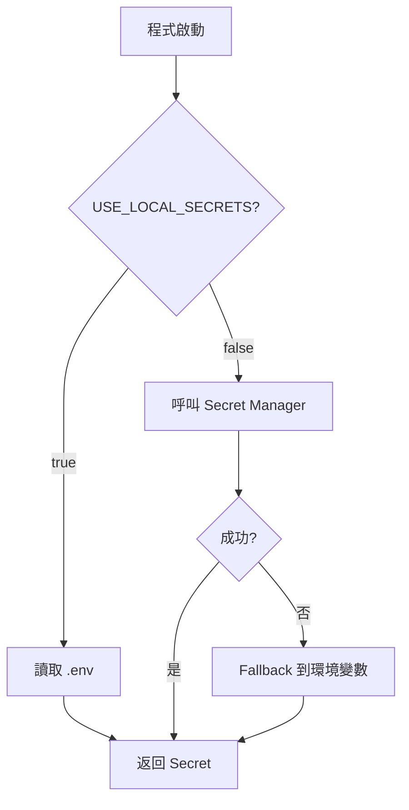

# 本地開發模式

## 關鍵字

- **.env**：本地環境變數檔案，模擬 Secret Manager。
- **python-dotenv**：自動載入 `.env` 檔案的 Python 套件。
- **Fallback Pattern**：先嘗試 Secret Manager，失敗則讀取環境變數。

## 學習目標

完成本章節後，您將能夠：

1. 設定本地開發的 Secret 替代方案
2. 實作 Fallback Pattern
3. 確保 `.env` 不被意外 commit

## 步驟說明

### 步驟 1：設定 .env 檔案

#### 我們在做什麼？

在本地開發時使用 `.env` 檔案儲存敏感資訊，避免呼叫真實的 Secret Manager。

#### 為什麼需要這樣做？

- 本地不需要真實 API Key（使用 Mock）
- 即使使用真實 Key，也不想每次都呼叫 Cloud API
- 保持開發環境可離線運作

#### .env 範例

```dotenv
# .env (不要 commit 此檔案！)

# ElevenLabs 設定
ELEVENLABS_API_KEY=sk-test-key-for-development

# GCP 設定
GOOGLE_CLOUD_PROJECT=elevendops-local
USE_FIRESTORE_EMULATOR=true
USE_GCS_EMULATOR=true
```

### 步驟 2：載入環境變數

#### 我們在做什麼？

使用 `python-dotenv` 在程式啟動時自動載入 `.env`。

#### 程式碼範例

```python
# backend/config.py
from pydantic_settings import BaseSettings
from dotenv import load_dotenv

# 載入 .env 檔案（如果存在）
load_dotenv()

class Settings(BaseSettings):
    # 直接從環境變數讀取
    elevenlabs_api_key: str = ""
    google_cloud_project: str = "elevendops-local"
    use_firestore_emulator: bool = True

    class Config:
        env_file = ".env"
        env_file_encoding = "utf-8"
```

### 步驟 3：實作 Fallback Pattern

#### 我們在做什麼？

建立一個通用函數：在雲端環境優先使用 Secret Manager，本地則 Fallback 到環境變數。

#### 程式碼範例

```python
import os
from google.cloud import secretmanager
from google.api_core.exceptions import NotFound

def get_secret(secret_id: str, fallback_env: str = None) -> str:
    """
    取得 Secret，優先從 Secret Manager，本地則讀取環境變數

    Args:
        secret_id: Secret Manager 中的 Secret 名稱
        fallback_env: 本地環境變數名稱（預設與 secret_id 相同）

    Returns:
        Secret 值
    """
    if fallback_env is None:
        fallback_env = secret_id

    # 本地開發模式：直接使用環境變數
    if os.getenv("USE_LOCAL_SECRETS", "false").lower() == "true":
        return os.environ.get(fallback_env, "")

    # 嘗試從 Secret Manager 讀取
    try:
        client = secretmanager.SecretManagerServiceClient()
        project_id = os.environ.get("GOOGLE_CLOUD_PROJECT")
        name = f"projects/{project_id}/secrets/{secret_id}/versions/latest"
        response = client.access_secret_version(request={"name": name})
        return response.payload.data.decode("UTF-8")
    except (NotFound, Exception) as e:
        # Fallback 到環境變數
        return os.environ.get(fallback_env, "")
```

#### 使用方式

```python
# 在程式中使用
api_key = get_secret("ELEVENLABS_API_KEY")

# 本地開發時，設定環境變數即可
# USE_LOCAL_SECRETS=true
# ELEVENLABS_API_KEY=sk-test-key
```

### 步驟 4：保護 .env 不被 commit

#### 我們在做什麼？

確保 `.env` 永遠不會被提交到 Git 版本控制。

#### .gitignore 設定

```gitignore
# 環境變數檔案 - 絕對不要 commit
.env
.env.local
.env.*.local

# 只提交範本檔案
!.env.example
```

#### .env.example 範本

```dotenv
# .env.example (可以 commit，提供給其他開發者參考)

# ElevenLabs 設定
ELEVENLABS_API_KEY=your-api-key-here

# GCP 設定
GOOGLE_CLOUD_PROJECT=your-project-id
USE_FIRESTORE_EMULATOR=true
USE_GCS_EMULATOR=true
```

#### 流程圖



## 常見問題 Q&A

### Q1：團隊成員如何取得 Secret？

**答：** 將 Secret 儲存在安全的地方（如 1Password、Bitwarden），新成員加入時分享。永遠不要透過 Slack/Email 傳送。

### Q2：CI/CD 環境如何處理？

**答：** GitHub Actions 可使用 Repository Secrets，Cloud Build 可直接存取 Secret Manager。

## 重點整理

| 環境          | Secret 來源                     | 設定方式                 |
| ------------- | ------------------------------- | ------------------------ |
| **本地開發**  | `.env` 檔案                     | `USE_LOCAL_SECRETS=true` |
| **Cloud Run** | Secret Manager                  | IAM 授權                 |
| **CI/CD**     | GitHub Secrets / Secret Manager | 各平台設定               |

---

## 參考程式碼來源

| 檔案路徑            | 說明                        |
| ------------------- | --------------------------- |
| `backend/config.py` | Settings 類別與環境變數載入 |
| `.env.example`      | 範本檔案（如有）            |

---

[⬅️ 返回 Secret Manager 索引](./index.md)
