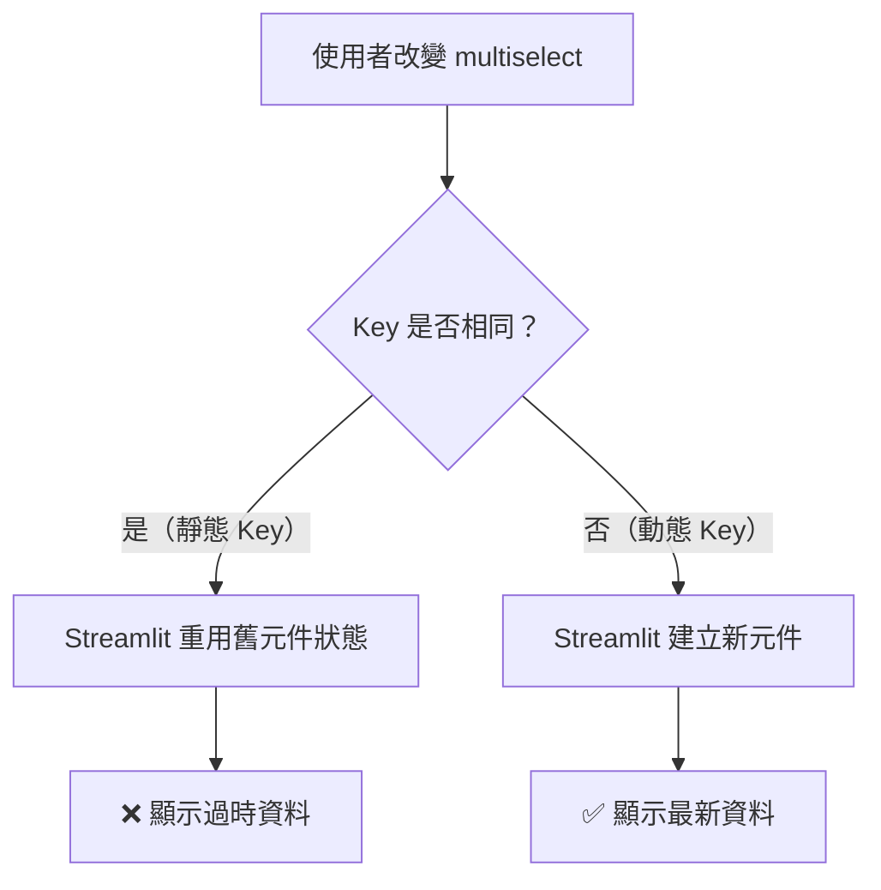

# 動態 Key 模式：基本概念

## 關鍵字

- **Widget Key**：Streamlit 用來識別元件實例的唯一識別碼
- **Static Key（靜態 Key）**：固定不變的 key 值，可能導致元件顯示過時資料
- **Dynamic Key（動態 Key）**：根據輸入資料動態產生的 key 值，強制元件重建
- **@st.fragment**：Streamlit 的片段裝飾器，用於隔離元件重新渲染範圍

## 學習目標

完成本章節後，您將能夠：

1. 理解 Streamlit 如何使用 Key 管理元件狀態
2. 識別靜態 Key 導致的資料過時問題
3. 解釋動態 Key 模式的運作原理

## 步驟說明

### 步驟 1：理解問題情境

#### 我們在做什麼？

分析為什麼使用靜態 Key 的元件會顯示過時的資料。

#### 為什麼需要這樣做？

當你在 Streamlit 應用程式中看到元件沒有正確更新時，通常是 Key 管理的問題。理解根本原因才能正確解決問題。

#### 問題範例

```python
# ❌ 使用靜態 Key - 元件會快取狀態
selected = st.multiselect("選擇項目", options=["A", "B", "C"])
result = external_component(selected, key="my_component")
```

當 `selected` 改變時，元件可能顯示舊資料，因為：

1. Streamlit 使用 `key` 來識別元件實例
2. 靜態 Key 讓 Streamlit 誤以為是同一個元件
3. 元件不知道輸入資料已經改變

#### 流程圖



### 步驟 2：理解動態 Key 解決方案

#### 我們在做什麼？

學習如何使用動態 Key 強制元件在資料改變時重建。

#### 為什麼需要這樣做？

動態 Key 會在輸入資料改變時產生新的識別碼，讓 Streamlit 認為這是一個「新的」元件，因此會完全重建它。

#### 解決方案

```python
# ✅ 使用動態 Key - 資料改變時強制重建
selected = st.multiselect("選擇項目", options=["A", "B", "C"])
dynamic_key = f"component_{hash(tuple(selected))}"
result = external_component(selected, key=dynamic_key)
```

#### 運作原理

1. **雜湊輸入資料**：`hash(tuple(selected))` 產生唯一整數
2. **嵌入 Key**：`f"component_{hash}"` 在資料改變時產生新 Key
3. **強制重建**：Streamlit 看到「新」元件並重建它

### 步驟 3：識別適用情境

#### 我們在做什麼？

學習判斷何時應該使用動態 Key 模式。

#### 為什麼需要這樣做？

動態 Key 不是萬靈丹，在某些情況下可能會造成效能問題或使用者體驗下降。

#### 何時使用動態 Key

| 情境       | 靜態 Key         | 動態 Key         |
| ---------- | ---------------- | ---------------- |
| 效能       | 較佳（重用狀態） | 稍慢（重建元件） |
| 資料新鮮度 | 可能過時         | 永遠是最新的     |
| 內部狀態   | 保留             | 重置             |
| 使用時機   | 穩定輸入         | 變動輸入         |

**✅ 適合使用動態 Key：**

- 輸入資料經常改變
- 看到過時/舊的元件資料
- 元件在 `@st.fragment` 內
- 第三方元件不會自動刷新

**❌ 避免使用：**

- 元件初始化成本很高
- 需要保留內部狀態（如捲動位置）
- 輸入資料永遠不變

## 常見問題 Q&A

### Q1：為什麼我的第三方元件不會更新？

**答**：第三方 Streamlit 元件通常會管理自己的內部狀態。當你使用靜態 Key 時，Streamlit 會重用舊的元件實例及其快取的狀態，即使你傳入的資料已經改變。使用動態 Key 可以強制元件完全重建。

### Q2：使用 `@st.fragment` 時為什麼特別容易遇到這個問題？

**答**：`@st.fragment` 會將元件的重新渲染範圍限制在片段內。當片段內的 multiselect 改變時，只會重新執行片段內的程式碼。如果第三方元件使用靜態 Key，它可能不會意識到輸入資料已經改變，因為元件的 Key 沒有變化。

### Q3：動態 Key 會影響效能嗎？

**答**：是的，每次 Key 改變時元件都會完全重建，這比重用現有狀態稍慢。但對於大多數應用程式來說，這個影響通常可以忽略不計。只有在元件初始化非常昂貴時才需要特別考慮。

## 重點整理

| 概念            | 說明                   | 使用時機                    |
| --------------- | ---------------------- | --------------------------- |
| 靜態 Key        | 固定的字串 Key         | 輸入資料不變的元件          |
| 動態 Key        | 根據輸入資料產生的 Key | 輸入資料會改變的元件        |
| `hash(tuple())` | 將列表轉換為可雜湊的值 | 動態 Key 的基礎技術         |
| `@st.fragment`  | 隔離重新渲染範圍       | 效能優化，但需注意 Key 管理 |

## 延伸閱讀

- [02--implementation.md](./02--implementation.md) - 實作範例與最佳實踐
- [Streamlit Widget State 文件](https://docs.streamlit.io/develop/concepts/architecture/widget-behavior)

---

## 參考程式碼來源

本文件中的程式碼範例參考自以下專案檔案：

| 檔案路徑                                   | 說明                                    |
| ------------------------------------------ | --------------------------------------- |
| `streamlit_app/pages/3_Education_Audio.py` | 修復 Content Modules 刷新問題的實際案例 |

---

[⬅️ 返回 Streamlit 動態 Key 模式 索引](./index.md)
