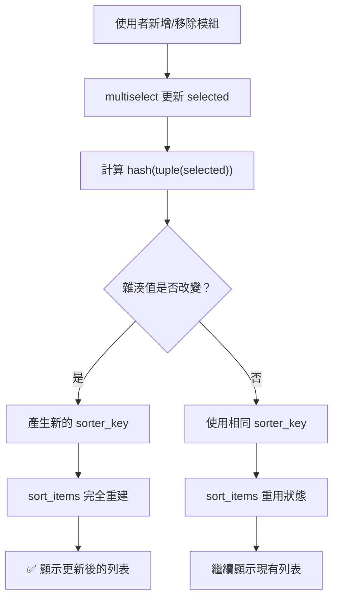

# 動態 Key 模式：實作與最佳實踐

## 關鍵字

- **`hash()`**：Python 內建函數，產生物件的雜湊值
- **`tuple()`**：將列表轉換為不可變的元組，使其可被雜湊
- **`frozenset()`**：不可變的集合，適合順序不重要的情況
- **`sort_items()`**：streamlit-sortables 套件的拖曳排序元件

## 學習目標

完成本章節後，您將能夠：

1. 實作動態 Key 模式解決元件刷新問題
2. 選擇適當的雜湊策略處理不同資料類型
3. 在 `@st.fragment` 中正確使用動態 Key
4. 除錯動態 Key 相關問題

## 步驟說明

### 步驟 1：基本動態 Key 實作

#### 我們在做什麼？

實作最基本的動態 Key 模式，處理列表類型的輸入資料。

#### 為什麼需要這樣做？

列表（list）在 Python 中是不可雜湊的，我們需要先將它轉換為元組（tuple）才能使用 `hash()` 函數。

#### 程式碼範例

```python
# 基本動態 Key 實作
items = st.multiselect("選擇項目", options=all_items)

# 將列表轉換為元組後雜湊
key = f"sorter_{hash(tuple(items))}"

# 使用動態 Key
ordered = sort_items(items, key=key)
```

### 步驟 2：在 Fragment 中使用動態 Key

#### 我們在做什麼？

在 `@st.fragment` 裝飾的函數中正確使用動態 Key。

#### 為什麼需要這樣做？

`@st.fragment` 會隔離元件的重新渲染範圍，這是動態 Key 最常見的應用場景。當片段內的 multiselect 改變時，使用動態 Key 可確保其他依賴該資料的元件也會正確更新。

#### 程式碼範例

```python
@st.fragment
def render_template_selection():
    """隔離的模板選擇片段，最小化重新渲染。"""
    if not st.session_state.available_templates:
        st.info("沒有可用的模板。")
        return

    template_options = {t.template_id: t for t in st.session_state.available_templates}

    # 使用者選擇模板
    selected = st.multiselect(
        "📋 內容模組",
        options=list(template_options.keys()),
        default=st.session_state.selected_templates,
        format_func=lambda x: template_options[x].display_name if x in template_options else x,
        help="選擇要包含在提示中的內容類型"
    )

    if selected and len(selected) > 0:
        st.caption("拖曳以重新排序內容模組：")
        selected_names = [template_options[t].display_name for t in selected if t in template_options]

        # 動態 Key 基於選取的項目 - 選取改變時強制重建
        sorter_key = f"template_sorter_{hash(tuple(selected))}"

        ordered_names = sort_items(
            selected_names,
            direction="vertical",
            key=sorter_key  # 使用動態 Key
        )

        # 根據排序後的順序重建 selected_templates
        name_to_id = {template_options[t].display_name: t for t in selected if t in template_options}
        st.session_state.selected_templates = [name_to_id[n] for n in ordered_names if n in name_to_id]

# 渲染隔離的模板選擇片段
render_template_selection()
```

#### 流程圖



### 步驟 3：處理不同資料類型

#### 我們在做什麼？

學習如何為不同類型的資料選擇適當的雜湊策略。

#### 為什麼需要這樣做？

不同的資料類型有不同的特性，選擇正確的雜湊策略可以提高效能並避免不必要的重建。

#### 雜湊策略對照表

| 資料類型           | 雜湊策略                         | 範例               |
| ------------------ | -------------------------------- | ------------------ |
| 列表（順序重要）   | `hash(tuple(data))`              | 排序元件、步驟清單 |
| 列表（順序不重要） | `hash(frozenset(data))`          | 標籤選擇、篩選條件 |
| 多個輸入           | `hash((input1, input2, ...))`    | 複合條件篩選       |
| 字典               | `hash(tuple(sorted(d.items())))` | 設定物件           |

#### 程式碼範例

```python
# 列表（順序重要）
selected = st.multiselect("選擇並排序", options=items)
key = f"component_{hash(tuple(selected))}"

# 列表（順序不重要）- 選 A,B 和 B,A 會產生相同 Key
filters = st.multiselect("篩選條件", options=filter_options)
key = f"table_{hash(frozenset(filters))}"

# 多個輸入的組合
category = st.selectbox("類別", options=categories)
status = st.selectbox("狀態", options=statuses)
key = f"data_{hash((category, status))}"

# 字典
config = {"sort": "asc", "limit": 10}
key = f"chart_{hash(tuple(sorted(config.items())))}"
```

### 步驟 4：常見應用場景

#### 1. 拖曳排序元件

```python
# 使用 streamlit-sortables 套件
from streamlit_sortables import sort_items

items = st.multiselect("選擇項目", options=all_items)
key = f"sorter_{hash(tuple(items))}"
ordered = sort_items(items, key=key)
```

#### 2. 資料表格搭配篩選

```python
# 篩選條件改變時重建表格
filters = st.multiselect("篩選器", options=filter_options)
key = f"table_{hash(tuple(filters))}"
st.dataframe(filtered_df, key=key)
```

#### 3. 動態資料來源的圖表

```python
# 選取的資料系列改變時重建圖表
selected_series = st.multiselect("系列", options=series_list)
key = f"chart_{hash(tuple(selected_series))}"
st.plotly_chart(fig, key=key)
```

### 步驟 5：除錯技巧

#### 我們在做什麼？

學習如何診斷和解決動態 Key 相關的問題。

#### 除錯步驟

```python
# 1. 印出 Key 值確認它有改變
st.caption(f"目前 Key: {key}")

# 2. 確認資料確實不同
st.write("目前選取:", selected)

# 3. 如果上述方法無效，在回呼中使用強制片段重新執行
def on_selection_change():
    st.rerun(scope="fragment")

st.multiselect("項目", options=items, on_change=on_selection_change)
```

## 常見問題 Q&A

### Q1：為什麼列表不能直接使用 `hash()`？

**答**：Python 的列表是可變物件（mutable），可變物件無法被雜湊。元組（tuple）是不可變的，所以我們需要先用 `tuple()` 轉換。

### Q2：`frozenset()` 和 `tuple()` 有什麼差別？

**答**：`tuple()` 會保留順序，相同元素不同順序會產生不同的雜湊值。`frozenset()` 不考慮順序，`{A, B}` 和 `{B, A}` 會產生相同的雜湊值。根據你的需求選擇適當的方法。

### Q3：動態 Key 改變時會發生什麼事？

**答**：Streamlit 會認為這是一個「新的」元件，完全丟棄舊元件的狀態並重新建立。這意味著任何內部狀態（如拖曳位置、捲動位置）都會重置。

## 重點整理

| 技術                    | 說明                     | 適用情境         |
| ----------------------- | ------------------------ | ---------------- |
| `hash(tuple(list))`     | 將列表轉為元組後雜湊     | 順序重要的列表   |
| `hash(frozenset(list))` | 將列表轉為凍結集合後雜湊 | 順序不重要的列表 |
| `hash((a, b, c))`       | 多個值組合成元組後雜湊   | 複合條件         |
| `f"prefix_{hash}"`      | 加上前綴方便除錯         | 所有動態 Key     |

## 最佳實踐清單

1. ✅ 使用 `tuple()` 轉換列表再雜湊
2. ✅ 為 Key 加上有意義的前綴（如 `sorter_`、`table_`）
3. ✅ 順序不重要時使用 `frozenset()`
4. ✅ 多個輸入時組合成元組再雜湊
5. ✅ 除錯時印出 Key 值確認變化
6. ❌ 不要對需要保留狀態的元件使用動態 Key
7. ❌ 不要對初始化成本很高的元件使用動態 Key

---

## 參考程式碼來源

本文件中的程式碼範例參考自以下專案檔案：

| 檔案路徑                                   | 說明                                                           |
| ------------------------------------------ | -------------------------------------------------------------- |
| `streamlit_app/pages/3_Education_Audio.py` | `render_template_selection()` 函數中的 sortables 動態 Key 實作 |
