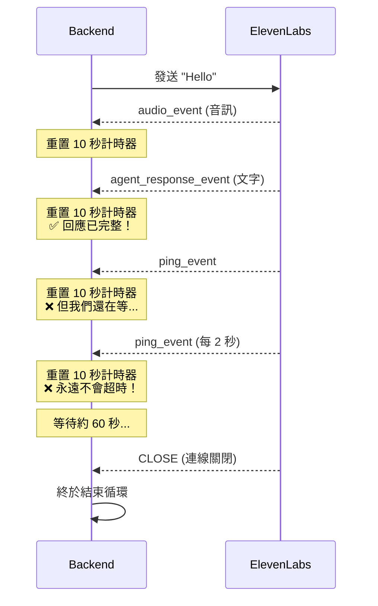

# 問題分析：WebSocket 無限等待

## 關鍵字

- **WebSocket Hang**：WebSocket 連線卡住，無法正常結束
- **Ping Event**：心跳事件，用於保持連線活躍
- **Timeout Reset**：超時計時器被重置，導致永遠不會超時
- **Event Loop**：事件循環，持續監聽並處理 WebSocket 訊息

## 學習目標

完成本章節後，您將能夠：

1. 識別 WebSocket 通訊中的無限等待問題
2. 理解 ping 事件如何導致超時計時器失效
3. 分析實際日誌找出問題根源

## 步驟說明

### 步驟 1：觀察問題現象

#### 我們在做什麼？

在 Patient Test 頁面測試 AI 對話功能時，發現使用者發送訊息後，系統需要等待約 60 秒才會收到回應。

#### 為什麼需要這樣做？

正常的對話應該在 2-3 秒內完成，60 秒的延遲會嚴重影響使用者體驗。我們需要找出延遲的原因。

#### 實際日誌範例

```log
2026-01-13 19:06:51 | DEBUG | websockets.client:state:175 | = connection is OPEN
2026-01-13 19:06:51 | DEBUG | websockets.client:send_frame:745 | > TEXT '{"text": "Hello", "try_trigger_generation": true}'
2026-01-13 19:06:53 | DEBUG | websockets.client:parse:599 | < TEXT '{"audio_event":{"audio_base_64":"BQAFAAIAAAABAA..."}}'
2026-01-13 19:06:53 | DEBUG | websockets.client:parse:599 | < TEXT '{"agent_response_event":{"agent_response":"Hello..."}}'
2026-01-13 19:06:53 | DEBUG | websockets.client:parse:599 | < TEXT '{"ping_event":{"event_id":2}}'
2026-01-13 19:06:55 | DEBUG | websockets.client:parse:599 | < TEXT '{"ping_event":{"event_id":3}}'
2026-01-13 19:06:57 | DEBUG | websockets.client:parse:599 | < TEXT '{"ping_event":{"event_id":4}}'
...
2026-01-13 19:07:51 | DEBUG | websockets.client:parse:599 | < CLOSE 1002 (protocol error)
```

**關鍵觀察：**

- `19:06:51` - 發送訊息
- `19:06:53` - 收到完整回應（文字 + 音訊）
- `19:06:53~19:07:51` - 持續收到 ping 事件（約 60 秒）
- `19:07:51` - 連線關閉

### 步驟 2：分析原始程式碼

#### 我們在做什麼？

檢視 `backend/services/elevenlabs_service.py` 中的 `send_text_message` 方法，找出為什麼會等待 60 秒。

#### 為什麼需要這樣做？

程式碼是問題的根源，我們需要理解現有的實作邏輯才能找到修復方向。

#### 原始程式碼（有問題的版本）

```python
async def send_text_message(self, agent_id: str, text: str) -> tuple[str, bytes]:
    # 連接 WebSocket
    async with websockets.connect(signed_url) as websocket:
        # 發送訊息
        await websocket.send(json.dumps({"text": text, "try_trigger_generation": True}))

        audio_chunks = []
        response_text_parts = []

        while True:
            try:
                # ❌ 問題：每次收到訊息都會重置 10 秒計時器
                message = await asyncio.wait_for(websocket.recv(), timeout=10.0)
                data = json.loads(message)

                if data.get("audio_event"):
                    audio_chunks.append(base64.b64decode(data["audio_event"]["audio_base_64"]))

                if data.get("agent_response_event"):
                    response_text_parts.append(data["agent_response_event"]["agent_response"])

                # ❌ 問題：沒有任何終止條件！

            except asyncio.TimeoutError:
                break  # 只有在 10 秒內沒有任何訊息時才會觸發
```

### 步驟 3：識別問題根源

#### 我們在做什麼？

分析為什麼 `asyncio.TimeoutError` 永遠不會被觸發。

#### 為什麼需要這樣做？

理解問題的根本原因是設計正確解決方案的前提。

#### 問題流程圖



## 常見問題 Q&A

### Q1：為什麼 ElevenLabs 要發送 ping 事件？

**答：** Ping 事件是 WebSocket 協定的標準機制，用於：

1. **保持連線活躍**：防止中間的代理伺服器或防火牆因為閒置而關閉連線
2. **檢測連線狀態**：確認雙方都還在線上
3. **測量延遲**：某些實作會用 ping/pong 來測量網路延遲

這是正常且必要的行為，問題不在於 ping 事件本身，而在於我們的程式碼沒有正確處理它。

### Q2：為什麼不直接在收到 `agent_response_event` 時就 `break`？

**答：** 這是一個很好的問題！如果我們立即 `break`，可能會遇到以下問題：

1. **音訊不完整**：`agent_response_event` 包含的是**文字回應**，但對應的**音訊資料**可能還在傳輸中
2. **時序問題**：根據日誌，`agent_response_event` 和 `audio_event` 幾乎同時到達，但不保證音訊一定先到

因此，我們需要一個「軟停止」機制：收到文字後，再等待一小段時間收集剩餘的音訊。

### Q3：60 秒是從哪裡來的？

**答：** 這是 ElevenLabs WebSocket 的預設行為。當連線建立後，如果使用者沒有發送新的訊息，ElevenLabs 會在約 60 秒後主動關閉連線（`CLOSE 1002 protocol error`）。

我們的程式碼一直在等待這個關閉事件，所以才會卡住 60 秒。

## 重點整理

| 概念          | 說明                                                  | 影響                     |
| ------------- | ----------------------------------------------------- | ------------------------ |
| Timeout Reset | 每次收到訊息時，`asyncio.wait_for` 的計時器會重新開始 | 導致永遠不會超時         |
| Ping Event    | ElevenLabs 每 2 秒發送一次心跳事件                    | 持續重置計時器，阻止超時 |
| 缺少終止條件  | 程式碼沒有明確的「回應已完成」判斷邏輯                | 只能等待連線關閉才能結束 |
| 60 秒連線超時 | ElevenLabs 的預設行為，無活動時自動關閉連線           | 這是我們唯一的退出機制   |

## 延伸閱讀

- [asyncio.wait_for 官方文件](https://docs.python.org/3/library/asyncio-task.html#asyncio.wait_for)
- [WebSocket Ping/Pong 機制](https://developer.mozilla.org/en-US/docs/Web/API/WebSockets_API/Writing_WebSocket_servers#pings_and_pongs_the_heartbeat_of_websockets)

---

## 參考程式碼來源

本文件中的程式碼範例參考自以下專案檔案：

| 檔案路徑                                 | 說明                                    |
| ---------------------------------------- | --------------------------------------- |
| `backend/services/elevenlabs_service.py` | ElevenLabs WebSocket 通訊實作（修復前） |
| `streamlit_app/pages/5_Patient_Test.py`  | Patient Test 頁面，觸發對話的前端介面   |

---

[⬅️ 返回 WebSocket Drain Timeout 索引](./index.md)
