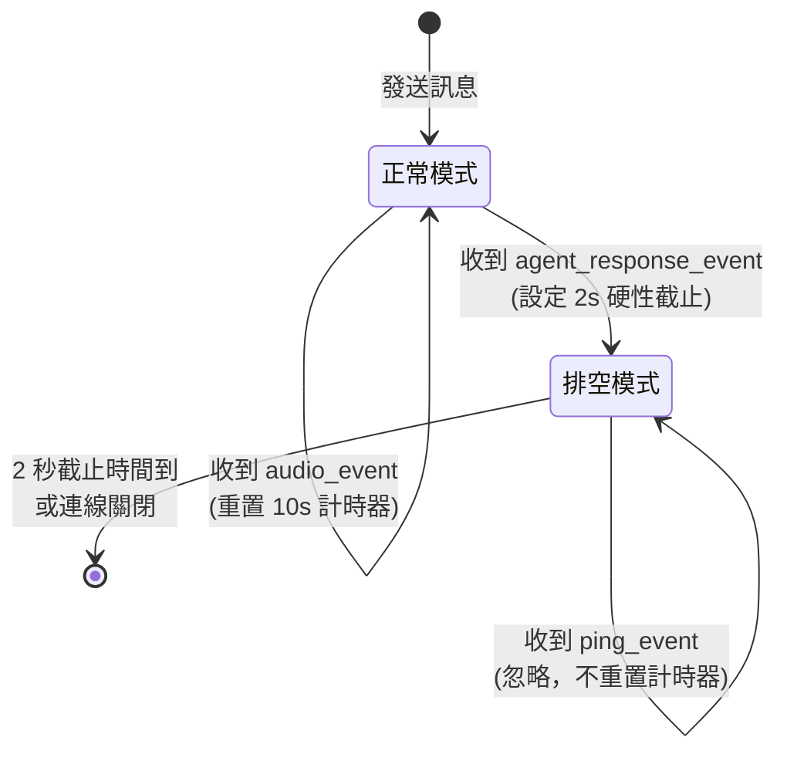

# Drain Timeout 模式設計原理

## 關鍵字

- **Drain Mode**：排空模式，收集剩餘資料的階段
- **Hard Deadline**：硬性截止時間，不會被重置的時間限制
- **Soft Stop**：軟停止，在確認主要回應後再等待一小段時間
- **Dynamic Timeout**：動態超時，根據當前狀態調整超時時間

## 學習目標

完成本章節後，您將能夠：

1. 理解 Drain Timeout 模式的設計理念
2. 區分「正常模式」與「排空模式」的差異
3. 掌握如何設定合適的 drain 時間

## 步驟說明

### 步驟 1：理解 Drain Timeout 的核心概念

#### 我們在做什麼？

Drain Timeout 是一種「兩階段超時」策略：

1. **正常模式**：等待主要回應（文字）
2. **排空模式**：收集剩餘資料（音訊），但有硬性時間限制

#### 為什麼需要這樣做？

單一超時機制有兩個問題：

- **太短**：可能錯過完整回應
- **太長**：會被 ping 事件無限延長

Drain Timeout 結合了兩者的優點：

- ✅ 確保收集完整資料
- ✅ 避免無限等待

#### 概念圖解



### 步驟 2：設計狀態轉換邏輯

#### 我們在做什麼？

定義兩個模式的行為差異。

#### 為什麼需要這樣做？

清楚的狀態定義能幫助我們寫出正確的程式碼。

#### 狀態對照表

| 狀態     | 觸發條件                    | 超時機制                   | 收到 ping 的行為 |
| -------- | --------------------------- | -------------------------- | ---------------- |
| 正常模式 | 初始狀態                    | 10 秒，每次收到訊息會重置  | 重置計時器       |
| 排空模式 | 收到 `agent_response_event` | 2 秒硬性截止，**不會重置** | **忽略**         |

### 步驟 3：計算動態超時時間

#### 我們在做什麼？

在排空模式中，我們需要動態計算「還剩多少時間」。

#### 為什麼需要這樣做？

`asyncio.wait_for` 需要一個超時值，但在排空模式中，這個值會隨著時間遞減。

#### 計算邏輯

```python
import time

# 進入排空模式時，設定硬性截止時間
drain_deadline = time.time() + 2.0  # 當前時間 + 2 秒

# 每次循環時，計算剩餘時間
while True:
    if drain_deadline:
        time_left = drain_deadline - time.time()
        if time_left <= 0:
            break  # 時間到，結束循環
        timeout = time_left  # 使用剩餘時間作為超時值
    else:
        timeout = 10.0  # 正常模式，使用固定 10 秒

    message = await asyncio.wait_for(websocket.recv(), timeout=timeout)
```

#### 時間軸圖解

```mermaid
gantt
    title Drain Timeout 時間軸
    dateFormat  ss
    axisFormat %S秒

    section 正常模式
    等待回應           :00, 3s

    section 排空模式
    收到 agent_response :milestone, 03, 0s
    設定 2s 截止時間    :crit, 03, 2s
    收集音訊 chunk 1    :04, 1s
    收到 ping (忽略)    :05, 0s
    收集音訊 chunk 2    :05, 1s
    截止時間到，結束    :milestone, 05, 0s
```



### 步驟 4：處理邊界情況

#### 我們在做什麼？

考慮各種可能的異常情況。

#### 為什麼需要這樣做？

健壯的程式碼需要處理所有可能的執行路徑。

#### 邊界情況表

| 情況                            | 處理方式                               |
| ------------------------------- | -------------------------------------- |
| 從未收到 `agent_response_event` | 保持正常模式，10 秒後超時退出          |
| 收到多個 `agent_response_event` | 只在第一次設定 drain_deadline          |
| drain 期間連線關閉              | 捕捉 `ConnectionClosed` 異常，正常退出 |
| drain 期間收到大量音訊          | 全部收集，直到截止時間                 |

## 常見問題 Q&A

### Q1：為什麼選擇 2 秒作為 drain 時間？

**答：** 這是基於以下考量：

1. **音訊傳輸速度**：ElevenLabs 的音訊是分塊傳輸的，通常在 1-2 秒內完成
2. **使用者體驗**：總回應時間 = 生成時間（1-2s）+ drain 時間（2s）≈ 3-4 秒，仍在可接受範圍
3. **安全邊際**：留一點緩衝，避免網路抖動導致音訊遺失

您可以根據實際測試結果調整這個值（建議範圍：1-3 秒）。

### Q2：如果在 drain 期間沒有收到任何音訊怎麼辦？

**答：** 這是正常的！有兩種可能：

1. **音訊已經全部收到**：在進入 drain 模式之前，所有音訊已經到達
2. **純文字回應**：某些情況下，agent 可能只返回文字，沒有音訊

程式碼會正常等待 2 秒後退出，不會有任何問題。

### Q3：Drain Timeout 和一般的 Timeout 有什麼不同？

**答：** 關鍵差異在於「是否會被重置」：

| 特性         | 一般 Timeout               | Drain Timeout            |
| ------------ | -------------------------- | ------------------------ |
| 計時器重置   | 每次收到訊息都重置         | 設定後不再重置           |
| 受 ping 影響 | 會被 ping 重置，永遠不超時 | 忽略 ping，準時結束      |
| 適用場景     | 等待任意數量的訊息         | 收集已知會結束的剩餘資料 |

## 重點整理

| 概念         | 說明                                     | 使用時機               |
| ------------ | ---------------------------------------- | ---------------------- |
| 兩階段超時   | 正常模式（可重置）+ 排空模式（不可重置） | 需要完整收集但避免卡住 |
| 硬性截止時間 | 使用絕對時間戳記，不受訊息影響           | 排空模式               |
| 動態超時計算 | `timeout = deadline - current_time`      | 每次循環重新計算       |
| 忽略 ping    | 在排空模式中不處理 ping 事件             | 防止計時器被重置       |

## 延伸閱讀

- [Two-Phase Commit Pattern](https://en.wikipedia.org/wiki/Two-phase_commit_protocol)
- [Graceful Shutdown Patterns](https://cloud.google.com/blog/products/containers-kubernetes/kubernetes-best-practices-terminating-with-grace)

---

## 參考程式碼來源

本文件中的程式碼範例參考自以下專案檔案：

| 檔案路徑                                 | 說明                             |
| ---------------------------------------- | -------------------------------- |
| `backend/services/elevenlabs_service.py` | Drain Timeout 模式實作（修復後） |

---

[⬅️ 返回 WebSocket Drain Timeout 索引](./index.md)
