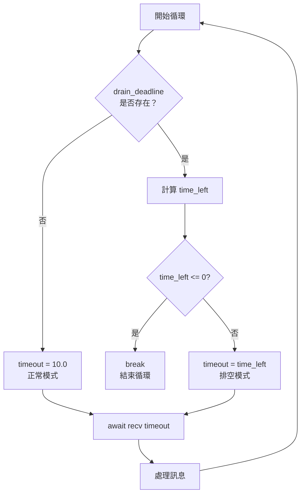

# 實作指南：Drain Timeout 完整程式碼

## 關鍵字

- **asyncio.wait_for**：Python 的非同步超時機制
- **time.time()**：取得當前 Unix 時間戳記
- **WebSocket recv()**：接收 WebSocket 訊息
- **State Variable**：狀態變數，用於追蹤當前模式

## 學習目標

完成本章節後，您將能夠：

1. 實作完整的 Drain Timeout 邏輯
2. 正確處理 WebSocket 事件
3. 整合到現有的 async/await 程式碼中

## 步驟說明

### 步驟 1：準備狀態變數

#### 我們在做什麼？

在 WebSocket 訊息循環開始前，初始化必要的變數。

#### 為什麼需要這樣做？

這些變數用於追蹤收集到的資料和當前的模式狀態。

#### 程式碼範例

```python
async def send_text_message(self, agent_id: str, text: str) -> tuple[str, bytes]:
    """發送文字訊息並取得 AI 回應。"""

    # 取得 WebSocket 連線 URL
    signed_url = self.get_signed_url(agent_id)

    async with websockets.connect(signed_url) as websocket:
        # 發送使用者訊息
        payload = {"text": text, "try_trigger_generation": True}
        await websocket.send(json.dumps(payload))

        # 初始化狀態變數
        audio_chunks = []          # 收集音訊資料
        response_text_parts = []   # 收集文字回應
        drain_deadline = None      # 排空模式截止時間（None = 正常模式）
```

### 步驟 2：實作動態超時邏輯

#### 我們在做什麼？

根據當前模式（正常/排空）計算適當的超時時間。

#### 為什麼需要這樣做？

這是 Drain Timeout 的核心：在排空模式中使用遞減的超時值。

#### 程式碼範例

```python
        while True:
            try:
                # 計算動態超時時間
                if drain_deadline:
                    # 排空模式：計算剩餘時間
                    import time
                    time_left = drain_deadline - time.time()

                    if time_left <= 0:
                        # 截止時間已到，結束循環
                        logging.info("Drain timeout reached, ending message collection")
                        break

                    timeout = time_left  # 使用剩餘時間
                else:
                    # 正常模式：使用固定超時
                    timeout = 10.0

                # 等待下一個訊息
                message = await asyncio.wait_for(websocket.recv(), timeout=timeout)
                data = json.loads(message)
```

#### 流程圖



### 步驟 3：處理不同類型的事件

#### 我們在做什麼？

根據收到的事件類型，執行對應的處理邏輯。

#### 為什麼需要這樣做？

不同的事件有不同的意義，需要分別處理。

#### 程式碼範例

```python
                # 處理音訊事件
                if data.get("audio_event"):
                    audio_base64 = data["audio_event"].get("audio_base_64")
                    if audio_base64:
                        audio_chunks.append(base64.b64decode(audio_base64))

                # 處理文字回應事件
                if data.get("agent_response_event"):
                    part = data["agent_response_event"].get("agent_response")
                    if part:
                        response_text_parts.append(part)

                    # 進入排空模式
                    if not drain_deadline:
                        import time
                        drain_deadline = time.time() + 2.0
                        logging.info("Agent response received, entering drain mode (2s deadline)")

                # 忽略 ping 事件（在排空模式中不影響超時）
                # ping_event 不需要特別處理
```

### 步驟 4：處理異常情況

#### 我們在做什麼？

捕捉可能的異常並正常退出循環。

#### 為什麼需要這樣做？

WebSocket 通訊可能因為超時或連線關閉而中斷，需要優雅地處理這些情況。

#### 程式碼範例

```python
            except asyncio.TimeoutError:
                # 超時：正常模式下 10 秒無訊息，或排空模式時間到
                logging.info("Timeout reached, ending message collection")
                break

            except websockets.exceptions.ConnectionClosed:
                # 連線關閉：ElevenLabs 主動關閉連線
                logging.info("WebSocket connection closed")
                break
```

### 步驟 5：組合回應並返回

#### 我們在做什麼？

將收集到的文字和音訊組合成最終回應。

#### 為什麼需要這樣做？

API 的呼叫者需要完整的回應資料。

#### 程式碼範例

```python
        # 組合最終回應
        full_text = "".join(response_text_parts)
        full_audio = b"".join(audio_chunks)

        # 檢查是否收到回應
        if not full_text and not full_audio:
            logging.warning("No response received from ElevenLabs agent")

        return full_text, full_audio
```

## 完整程式碼

以下是完整的 `send_text_message` 方法實作：

```python
async def send_text_message(self, agent_id: str, text: str) -> tuple[str, bytes]:
    """Send a text message to the agent and get audio response.

    Args:
        agent_id: The agent ID.
        text: The user's message.

    Returns:
        tuple[str, bytes]: (Response text, Audio data)

    Raises:
        ElevenLabsAgentError: If communication fails.
    """
    if self.use_mock:
        logging.info(f"[MOCK] send_text_message called: agent={agent_id}, text={text[:50]}...")
        mock_audio = b'\\xff\\xfb\\x90\\x00' + b'\\x00' * 417
        return ("This is a mock response from the AI assistant.", mock_audio)

    try:
        # 取得 WebSocket 連線 URL
        signed_url = self.get_signed_url(agent_id)

        async with websockets.connect(signed_url) as websocket:
            # 發送使用者訊息
            payload = {"text": text, "try_trigger_generation": True}
            await websocket.send(json.dumps(payload))

            # 初始化狀態變數
            audio_chunks = []
            response_text_parts = []
            drain_deadline = None  # None = 正常模式

            # 訊息收集循環（Drain Timeout 策略）
            while True:
                try:
                    # 計算動態超時時間
                    if drain_deadline:
                        # 排空模式：計算剩餘時間
                        import time
                        time_left = drain_deadline - time.time()
                        if time_left <= 0:
                            logging.info("Drain timeout reached, ending message collection")
                            break
                        timeout = time_left
                    else:
                        # 正常模式：使用固定超時
                        timeout = 10.0

                    # 等待下一個訊息
                    message = await asyncio.wait_for(websocket.recv(), timeout=timeout)
                    data = json.loads(message)

                    # 處理音訊事件
                    if data.get("audio_event"):
                        audio_base64 = data["audio_event"].get("audio_base_64")
                        if audio_base64:
                            audio_chunks.append(base64.b64decode(audio_base64))

                    # 處理文字回應事件
                    if data.get("agent_response_event"):
                        part = data["agent_response_event"].get("agent_response")
                        if part:
                            response_text_parts.append(part)

                        # 進入排空模式
                        if not drain_deadline:
                            import time
                            drain_deadline = time.time() + 2.0
                            logging.info("Agent response received, entering drain mode (2s deadline)")

                    # ping_event 會被忽略（不影響排空模式的超時）

                except asyncio.TimeoutError:
                    break
                except websockets.exceptions.ConnectionClosed:
                    break

            # 組合最終回應
            full_text = "".join(response_text_parts)
            full_audio = b"".join(audio_chunks)

            if not full_text and not full_audio:
                logging.warning("No response received from ElevenLabs agent")

            return full_text, full_audio

    except Exception as e:
        logging.error(f"Failed to send text message: {e}")
        raise ElevenLabsAgentError(f"Failed to send text message: {str(e)}")
```

## 常見問題 Q&A

### Q1：為什麼要在兩個地方 `import time`？

**答：** 這是為了避免在模組頂部導入但只在特定情況下使用。不過，更好的做法是在檔案開頭統一導入：

```python
# 在檔案開頭
import time
```

然後在程式碼中直接使用 `time.time()`。

### Q2：如果 `agent_response_event` 包含多個部分怎麼辦？

**答：** 程式碼使用 `response_text_parts.append(part)` 來收集所有部分，最後用 `"".join()` 組合。這樣可以處理分段傳輸的文字回應。

### Q3：為什麼不在收到 `audio_event` 時也進入排空模式？

**答：** 因為音訊可能在文字之前或之後到達，我們無法確定「最後一個音訊」是哪一個。只有 `agent_response_event` 明確表示「文字回應已完成」，這是一個可靠的信號。

## 重點整理

| 步驟         | 關鍵程式碼                               | 說明                   |
| ------------ | ---------------------------------------- | ---------------------- |
| 初始化狀態   | `drain_deadline = None`                  | None 表示正常模式      |
| 計算動態超時 | `timeout = drain_deadline - time.time()` | 排空模式使用遞減超時   |
| 進入排空模式 | `drain_deadline = time.time() + 2.0`     | 收到文字後設定截止時間 |
| 檢查時間到期 | `if time_left <= 0: break`               | 硬性截止，立即結束     |
| 處理異常     | `except asyncio.TimeoutError: break`     | 優雅退出               |

## 延伸閱讀

- [Python asyncio 官方教學](https://docs.python.org/3/library/asyncio.html)
- [websockets 套件文件](https://websockets.readthedocs.io/)

---

## 參考程式碼來源

本文件中的程式碼範例參考自以下專案檔案：

| 檔案路徑                                 | 說明                      |
| ---------------------------------------- | ------------------------- |
| `backend/services/elevenlabs_service.py` | 完整的 Drain Timeout 實作 |

---

[⬅️ 返回 WebSocket Drain Timeout 索引](./index.md)
