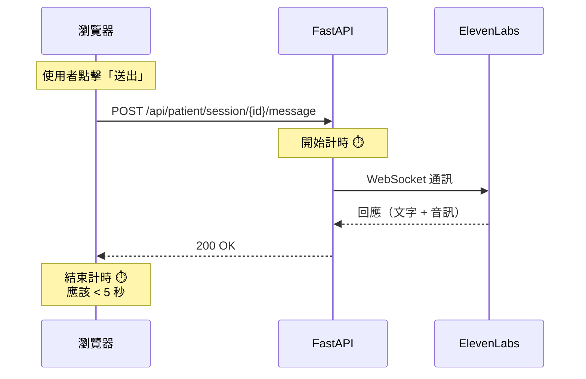

# 測試與驗證策略

## 關鍵字

- **Manual Testing**：手動測試，透過實際操作驗證功能
- **Mock WebSocket**：模擬 WebSocket，用於單元測試
- **Response Time**：回應時間，衡量效能的關鍵指標
- **Regression Testing**：回歸測試，確保修復沒有破壞現有功能

## 學習目標

完成本章節後，您將能夠：

1. 設計有效的測試案例
2. 執行手動測試驗證修復
3. 理解如何測量回應時間

## 步驟說明

### 步驟 1：手動測試（推薦）

#### 我們在做什麼？

透過 Patient Test 頁面實際測試 AI 對話功能。

#### 為什麼需要這樣做？

手動測試能夠驗證完整的使用者流程，包含前端、後端和 ElevenLabs API 的整合。

#### 測試步驟

1. **啟動伺服器**

```powershell
# 在專案根目錄執行
.\\start-servers-simple.ps1
```

2. **開啟 Patient Test 頁面**

- 瀏覽器訪問：`http://localhost:8501/Patient_Test`

3. **建立測試對話**

| 步驟 | 操作                                | 預期結果              |
| ---- | ----------------------------------- | --------------------- |
| 1    | 輸入 Patient ID（或點擊 Demo 按鈕） | 顯示綠色確認訊息      |
| 2    | 選擇一個 Agent（例如：Dr.eye）      | Agent 資訊顯示        |
| 3    | 點擊「Start Conversation」          | 顯示「Connected」狀態 |
| 4    | 輸入訊息「Hello」並送出             | **2-3 秒內**收到回應  |
| 5    | 檢查回應內容                        | 包含文字和音訊        |
| 6    | 播放音訊                            | 音訊正常播放，無截斷  |

4. **測量回應時間**

開啟瀏覽器開發者工具（F12），切換到 Network 標籤：



#### 驗證標準

| 指標         | 修復前 | 修復後目標 | 實際結果 |
| ------------ | ------ | ---------- | -------- |
| 回應時間     | ~60 秒 | 2-5 秒     | **\_**   |
| 文字完整性   | ✅     | ✅         | **\_**   |
| 音訊完整性   | ✅     | ✅         | **\_**   |
| 音訊播放正常 | ✅     | ✅         | **\_**   |

### 步驟 2：日誌驗證

#### 我們在做什麼？

檢查後端日誌，確認 Drain Timeout 邏輯正確執行。

#### 為什麼需要這樣做？

日誌能夠顯示內部執行流程，幫助我們確認程式碼按預期運作。

#### 預期日誌輸出

```log
# 正常模式
2026-01-13 19:30:00 | DEBUG | websockets.client:send_frame | > TEXT '{"text": "Hello", ...}'

# 收到回應，進入排空模式
2026-01-13 19:30:02 | INFO  | backend.services.elevenlabs_service | Agent response received, entering drain mode (2s deadline)

# 排空模式結束
2026-01-13 19:30:04 | INFO  | backend.services.elevenlabs_service | Drain timeout reached, ending message collection
```

**關鍵檢查點：**

- ✅ 看到「entering drain mode」訊息
- ✅ 看到「Drain timeout reached」訊息
- ✅ 兩者時間差約 2 秒
- ✅ 沒有看到大量的 ping_event（表示已被忽略）

### 步驟 3：單元測試（選用）

#### 我們在做什麼？

撰寫自動化測試來驗證 Drain Timeout 邏輯。

#### 為什麼需要這樣做？

自動化測試可以在未來的程式碼變更中快速驗證功能是否正常。

#### 測試案例設計

```python
@pytest.mark.asyncio
async def test_drain_timeout_prevents_hang():
    """測試 Drain Timeout 防止無限等待"""

    # 模擬 WebSocket 事件序列
    mock_events = [
        {"audio_event": {"audio_base_64": "..."}},
        {"agent_response_event": {"agent_response": "Hello"}},  # 觸發 drain
        {"ping_event": {"event_id": 1}},  # 應該被忽略
        {"ping_event": {"event_id": 2}},  # 應該被忽略
    ]

    start_time = time.time()
    response_text, audio_data = await service.send_text_message("agent_id", "Hello")
    elapsed = time.time() - start_time

    # 驗證：應該在 5 秒內完成（不是 60 秒）
    assert elapsed < 5.0
    assert response_text == "Hello"
```

**注意：** 由於 async WebSocket mocking 的複雜性，建議優先使用手動測試。

### 步驟 4：回歸測試

#### 我們在做什麼？

確認修復沒有破壞其他功能。

#### 為什麼需要這樣做？

程式碼變更可能產生意外的副作用，需要全面驗證。

#### 測試清單

- [ ] Agent Setup 頁面：建立新 Agent 功能正常
- [ ] Agent Setup 頁面：編輯現有 Agent 功能正常
- [ ] Patient Test 頁面：多輪對話功能正常
- [ ] Patient Test 頁面：結束對話功能正常
- [ ] Education Audio 頁面：音訊播放功能正常

## 常見問題 Q&A

### Q1：如果手動測試時回應時間仍然很長怎麼辦？

**答：** 請檢查以下幾點：

1. **確認程式碼已更新**：重新啟動伺服器，確保載入最新程式碼
2. **檢查日誌**：查看是否有「entering drain mode」訊息
3. **網路問題**：ElevenLabs API 本身的回應時間可能較慢
4. **Agent 配置**：某些 Agent 可能需要更長的處理時間

### Q2：音訊有時會被截斷怎麼辦？

**答：** 這可能表示 2 秒的 drain 時間不夠。您可以：

1. 增加 drain 時間到 3 秒：`drain_deadline = time.time() + 3.0`
2. 檢查網路連線品質
3. 查看日誌，確認是否有 `audio_event` 在 drain 截止後才到達

### Q3：如何確認 ping 事件真的被忽略了？

**答：** 在程式碼中加入除錯日誌：

```python
if data.get("ping_event"):
    if drain_deadline:
        logging.debug(f"Ignoring ping in drain mode (time_left: {time_left:.2f}s)")
    else:
        logging.debug("Received ping in normal mode")
```

然後檢查日誌，應該看到「Ignoring ping in drain mode」訊息。

## 重點整理

| 測試類型 | 目的                 | 執行時機     | 重要性 |
| -------- | -------------------- | ------------ | ------ |
| 手動測試 | 驗證完整使用者流程   | 每次修改後   | ⭐⭐⭐ |
| 日誌驗證 | 確認內部邏輯正確     | 手動測試同時 | ⭐⭐⭐ |
| 單元測試 | 自動化驗證核心邏輯   | 可選         | ⭐⭐   |
| 回歸測試 | 確保沒有破壞其他功能 | 重大變更後   | ⭐⭐⭐ |

## 延伸閱讀

- [Testing WebSocket Applications](https://websockets.readthedocs.io/en/stable/topics/testing.html)
- [pytest-asyncio Documentation](https://pytest-asyncio.readthedocs.io/)

---

## 參考程式碼來源

本文件中的程式碼範例參考自以下專案檔案：

| 檔案路徑                                 | 說明                   |
| ---------------------------------------- | ---------------------- |
| `tests/test_elevenlabs_websocket_fix.py` | 單元測試範例（參考用） |
| `streamlit_app/pages/5_Patient_Test.py`  | 手動測試的前端介面     |

---

[⬅️ 返回 WebSocket Drain Timeout 索引](./index.md)
