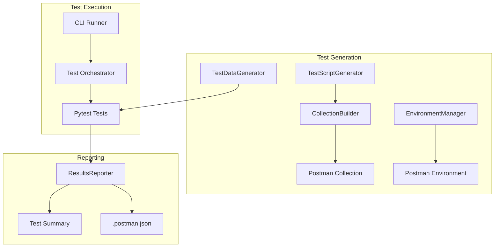

# Architecture

## System Overview

The Postman testing system provides comprehensive API testing through property-based tests and integration tests.

## Core Components

| Component           | Location                                    | Purpose                    |
| ------------------- | ------------------------------------------- | -------------------------- |
| CollectionBuilder   | `backend/services/collection_builder.py`    | Builds Postman collections |
| TestScriptGenerator | `backend/services/test_script_generator.py` | Generates JS test scripts  |
| TestDataGenerator   | `backend/services/test_data_generator.py`   | Creates test data          |
| EnvironmentManager  | `backend/services/environment_manager.py`   | Manages environments       |
| TestOrchestrator    | `tests/postman/test_orchestrator.py`        | Coordinates test runs      |
| ResultsReporter     | `tests/postman/results_reporter.py`         | Generates reports          |

## Test Flow

1. **Setup**: Load configuration from `.postman.json`
2. **Health Check**: Verify backend is running
3. **Execute**: Run pytest test suite
4. **Report**: Generate summary and update config
5. **Cleanup**: Remove test resources
