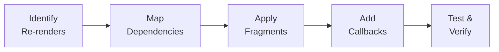

# Streamlit UI Rendering Optimization Guide

This guide outlines advanced techniques for reducing unnecessary re-renders in Streamlit applications, ensuring a smooth and responsive user experience.

## Optimization Strategy Overview

When optimizing a Streamlit app, follow this systematic approach:

1. **Identify Re-render Sources**: Use browser DevTools or visual inspection to find which interactions cause full-page reruns
2. **Map Component Dependencies**: Understand which components depend on shared state
3. **Apply Fragment Isolation**: Wrap independent sections in `@st.fragment`
4. **Use Callback-Based Updates**: Replace inline state updates with `on_change` callbacks
5. **Optimize State Propagation**: Use `st.rerun()` only when cross-fragment communication is needed



---

## 1. Nested Fragment Isolation

The `@st.fragment` decorator is powerful, but a large fragment still re-renders everything within it. For complex UIs, use **nested fragments** to isolate light interactions (like toggles or multiselects) from heavy components (like large text areas or dataframes).

### The Pattern

```python
@st.fragment
def parent_fragment():
    # Heavy component
    st.text_area("Large Content", height=600)

    # Isolated light component
    @st.fragment
    def nested_lite_config():
        st.toggle("Show Extra Options")
        st.multiselect("Pick Tags", options=["A", "B"])

    nested_lite_config()
```

**Benefits**:

- Changing the toggle only re-runs `nested_lite_config`.
- The "Large Content" text area remains stable and does not flicker.

---

## 2. Stable Component Keys

Streamlit components (especially custom ones like `streamlit-sortables`) often reset their state if their `key` changes. Avoid using dynamic hashes as keys unless you explicitly want a full reset.

### ❌ Problematic (Dynamic Key)

```python
# Re-initializes every time selection changes, losing drag/scroll state
sorter_key = f"sorter_{hash(tuple(selection))}"
sort_items(items, key=sorter_key)
```

### ✅ Optimized (Stable Key)

```python
# Component persists and handles internal updates smoothly
sort_items(items, key="stable_sorter_id")
```

---

## 3. Callback-Based State Updates

Directly assigning widget values to `st.session_state` in the main flow can trigger immediate reruns. Use `key` and `on_change` callbacks for more controlled state transitions.

### The Implementation

```python
def on_change_callback():
    st.session_state.actual_state = st.session_state.widget_key

st.multiselect(
    "Select Options",
    options=OPTIONS,
    key="widget_key",
    on_change=on_change_callback
)
```

This ensures the session state is updated _before_ any fragment or page rerun logic is evaluated.

---

## 4. Lazy Rendering in Expanders

Do not compute or render complex information inside `st.expander` unless the expander is open.

```python
with st.expander("Details"):
    if st.session_state.get("details_expanded"): # Optional check
        # Only do heavy work here
        for item in heavy_list:
            render_item(item)
```

---

## 5. Section-Level Fragment Isolation

When a page has multiple independent sections (tabs, sidebar panels, column groups), wrap each section in its own fragment. This prevents changes in one section from re-rendering unrelated sections.

### The Pattern

```python
@st.fragment
async def render_script_editor():
    col1, col2 = st.columns([1.5, 2.5])

    with col1:
        settings_tab, content_tab = st.tabs(["⚙️ Settings", "📝 Content"])

        with settings_tab:
            # Wrap entire tab in a fragment
            @st.fragment
            def render_settings_tab():
                st.selectbox("Duration", options=[3, 5, 10])
                st.selectbox("AI Model", options=["model-a", "model-b"])

            render_settings_tab()

    with col2:
        # Script editor stays stable when settings change
        st.text_area("Script", height=600)
```

**Benefits**:

- Changes in Settings tab don't re-render the script text area
- Each tab operates independently, reducing flicker
- Particularly useful for column layouts where one column has controls and another has content

---

## 6. Conditional Full Rerun Pattern

When a fragment needs to propagate state changes to other fragments, use `st.rerun()` explicitly. This is essential when selection changes should reset dependent components.

### The Pattern

```python
@st.fragment
async def render_document_selection(documents):
    selected = st.selectbox("Choose document:", options=documents)

    if selected:
        # Check if selection actually changed
        if (st.session_state.current_doc
            and st.session_state.current_doc.id != selected.id):
            # Reset dependent state
            st.session_state.generated_content = ""
            st.session_state.current_doc = selected
            # Trigger full rerun to propagate changes
            st.rerun()

        st.session_state.current_doc = selected
```

**Benefits**:

- Fragment isolation for normal interactions (browsing the dropdown)
- Full rerun only when actually needed (document change)
- Clear separation between local UI updates and global state propagation

---

## 7. Async Fragment Pattern

When using async functions with `@st.fragment`, ensure proper handling of coroutines.

### The Pattern

```python
@st.fragment
async def render_async_section():
    """Fragment with async data loading."""
    if st.button("Load Data"):
        with st.spinner("Loading..."):
            data = await fetch_data_async()
            st.session_state.cached_data = data

    if "cached_data" in st.session_state:
        st.dataframe(st.session_state.cached_data)
```

**Benefits**:

- Async operations stay isolated within the fragment
- Button clicks only re-run this fragment, not the entire page
- Spinner shows only within the fragment context

---

## 8. Dataframe Selection Optimization

When using `st.dataframe` with `selection_mode`, wrap it in a fragment and use conditional reruns.

### ❌ Problematic

```python
# Every row click reruns the entire page
event = st.dataframe(df, selection_mode="single-row", on_select="rerun")
if event.selection.rows:
    show_details(df.iloc[event.selection.rows[0]])
```

### ✅ Optimized

```python
@st.fragment
def render_data_table(df):
    event = st.dataframe(df, selection_mode="single-row", on_select="rerun")

    if event.selection.rows:
        selected_id = df.iloc[event.selection.rows[0]]["id"]
        # Only full rerun if selection actually changed
        if st.session_state.get("selected_id") != selected_id:
            st.session_state.selected_id = selected_id
            st.rerun()  # Propagate to detail view fragment
```

**Benefits**:

- Browsing the dataframe stays within the fragment
- Full rerun only when a new row is selected
- Detail view fragment can watch `session_state.selected_id`

---

## Summary Table

| Technique             | When to Use                                         | Impact                                            |
| --------------------- | --------------------------------------------------- | ------------------------------------------------- |
| **Nested Fragments**  | When light widgets share a fragment with heavy ones | Prevents flicker in large components              |
| **Stable Keys**       | When using interactive custom components            | Preserves internal component state (drag, scroll) |
| **Callbacks**         | When state updates should happen before logic       | Controls rerun flow and batches updates           |
| **Lazy Expanders**    | When showing detailed metadata                      | Reduces DOM size and initial render time          |
| **Section Fragments** | When page has independent sections (tabs, columns)  | Isolates section reruns from each other           |
| **Conditional Rerun** | When fragment changes need to propagate globally    | Balances isolation with state propagation         |
| **Async Fragments**   | When loading data asynchronously                    | Keeps async ops isolated from page                |
| **Dataframe Select**  | When using dataframe row selection                  | Prevents unnecessary reruns on every click        |
