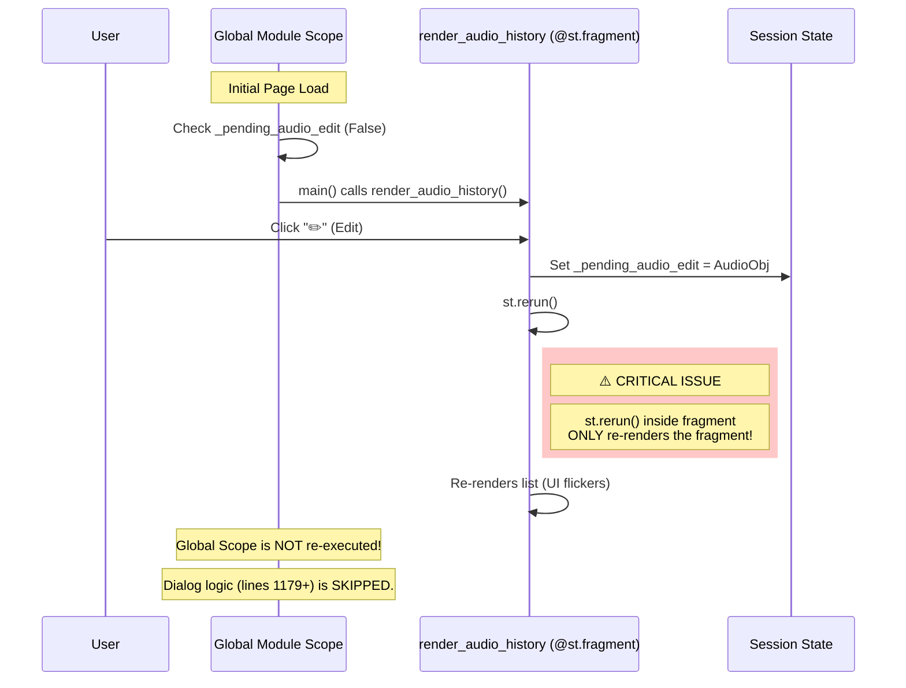
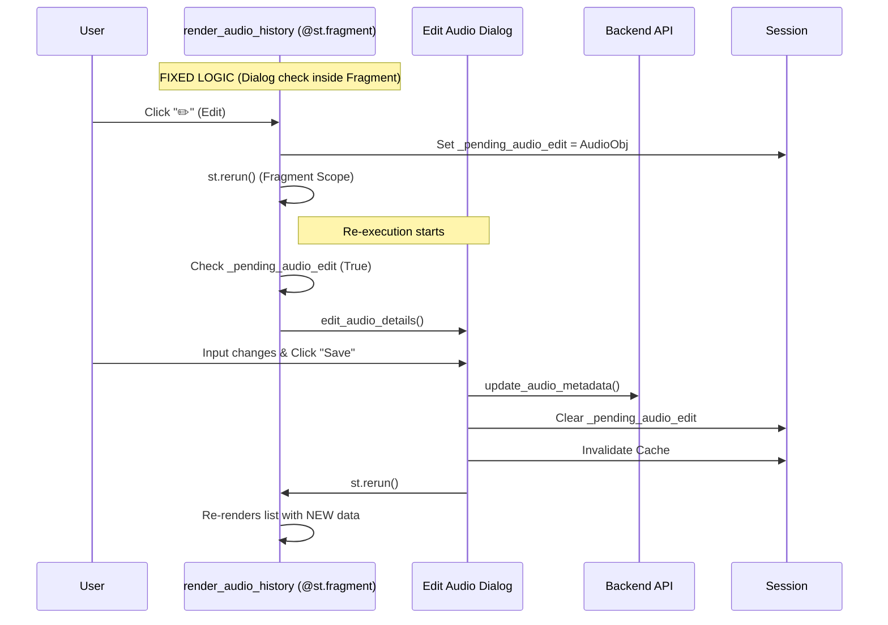

# Audio Edit Mechanism & Issue Diagnosis

## Problem Analysis

The `Edit Audio Details` dialog fails to appear because of a scoping issue with `st.fragment`.

In `3_Education_Audio.py`:

1. `render_audio_history` is decorated with `@st.fragment`.
2. When the **Edit** button is clicked inside this function, `st.rerun()` is called.
3. Inside a fragment, `st.rerun()` **only re-runs the fragment function**.
4. The code that checks `if st.session_state.get("_pending_audio_edit"):` and renders the dialog is located **outside** the fragment (at the module level/global scope).
5. Therefore, the dialog logic is **ignored** during the fragment rerun.

## Mechanism Flowchart

## Proposed Fix

Move the dialog handling logic **inside** the `render_audio_history` function so it is evaluated during the fragment rerun.

